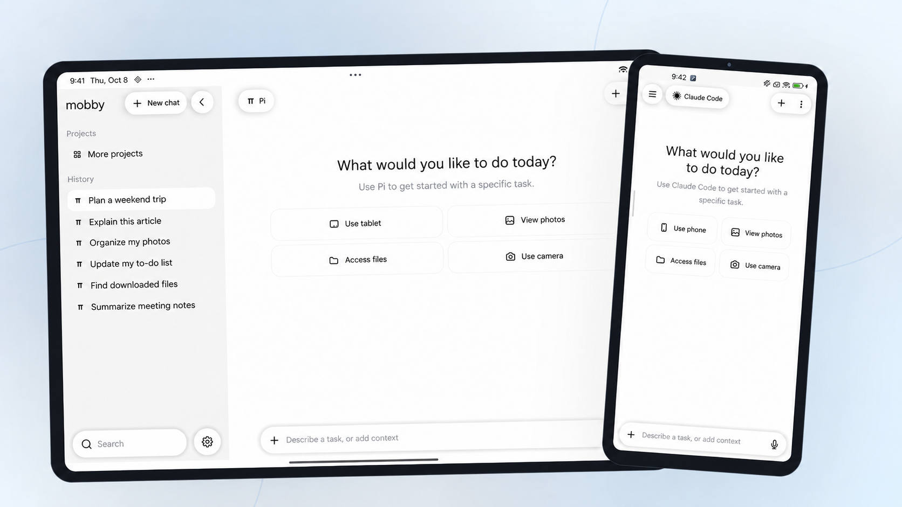
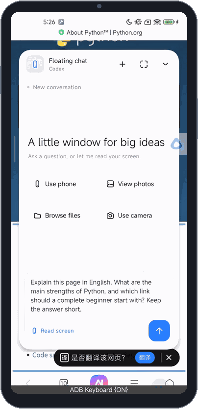
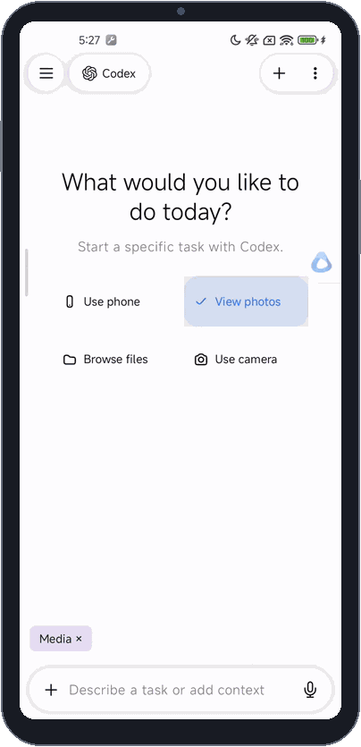
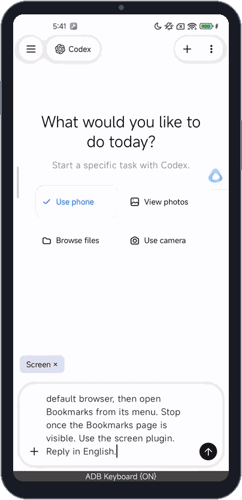
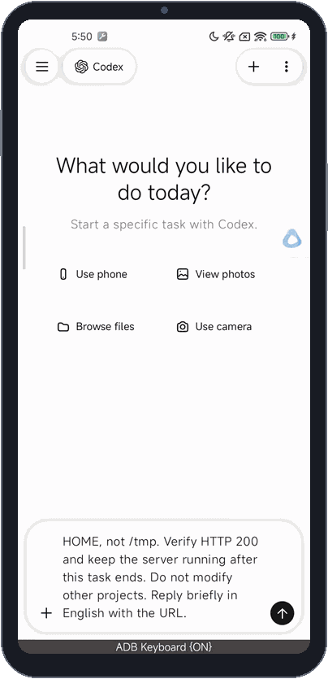

  

<h1 align="center">mobby</h1>

Ask about your screen, work with files, use apps, and write code on Android.

English · <a href="docs/README.zh-CN.md">简体中文</a>

  <a href="#ask-about-whats-on-your-screen">Screen Q&amp;A</a> ·
  <a href="#work-with-photos-and-files">Photos and files</a> ·
  <a href="#let-it-use-apps-for-you">App control</a> ·
  <a href="#build-something-useful-on-your-android-device">Coding on Android</a> ·
  <a href="#getting-started">Getting started</a>

mobby runs coding agents such as Pi, Claude Code, Codex, and OpenCode directly on Android, with access to your screen, photos, and files. Use it as your personal AI assistant to understand a page, work with files, operate apps, or write and run code on your device.

## Ask about what's on your screen

Reading a page you don't understand? Tap the floating button, open the floating chat, and use screen recognition. Ask mobby to translate the text, explain it, or answer a follow-up question.

> What is this page about? What makes Python useful, and where should a beginner start?

## Work with photos and files

Add photo or file access to a task and choose the photos or folder to share. Ask mobby to describe an image, copy files, make a list, and save the results back to your phone.

> Look at my recent photos, copy the latest one to the folder I selected, and create an image summary and a file list.

## Let it use apps for you

Add phone or tablet access to a task and describe what you want to do. mobby reads the screen, taps buttons, types text, and moves between pages to carry out the steps.

> Install Via browser from the app store and open Bookmarks.

## Build something useful on your Android device

Describe what you need. Let the agent write the code in your device's workspace, start a local server, and open the result in your browser.

> Make a travel packing list with categories for documents, clothes, electronics, and toiletries. Let me check off, add, and delete items, and keep my changes after a refresh.

[Browse the example code](docs/examples/travel-checklist-en/)

## Getting started

mobby supports ARM64 Android phones and tablets running Android 8.0 or later.

1. **Install mobby.** Get the APK from [Releases](https://github.com/ytlog/mobby/releases) and open it on your device. Wait for the runtime to initialize; Claude Code downloads from its official source during setup.
2. **Set up a gateway.** Open **Settings → Gateway settings**, choose a service or enter its base URL and API key, tap **Get models**, select a default model, then save the gateway.
3. **Start a conversation.** Select the gateway and send a task. For screen Q&A, enable the floating button, display-over-other-apps permission, and the Screen accessibility service. Grant photo or file access when you use those features.

[Build and usage guide](docs/getting-started.md) · [Gateway setup](docs/gateway.md) · [Project docs](docs/README.md) · [MIT license](LICENSE)
