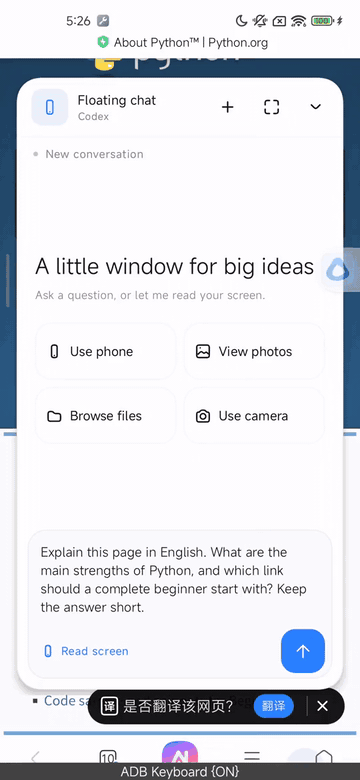
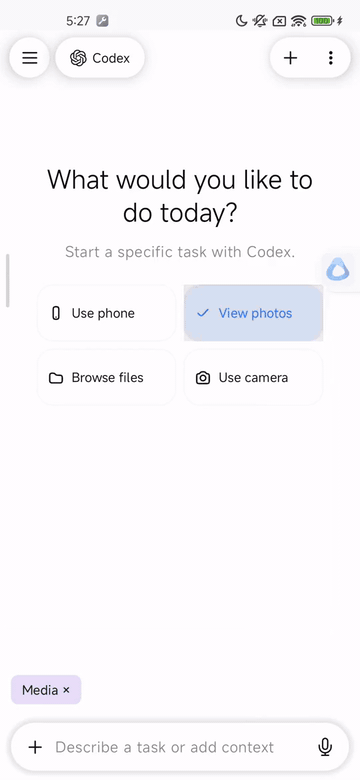
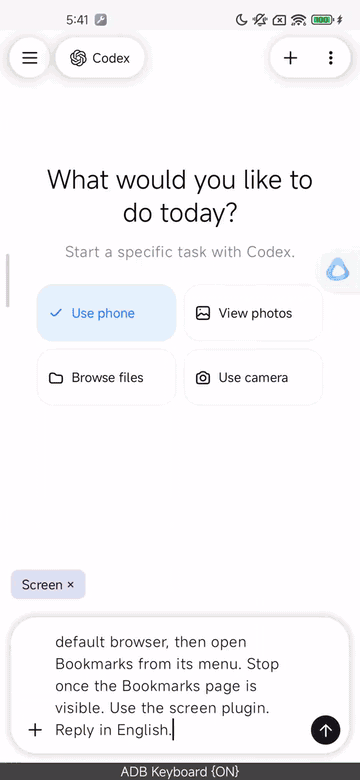
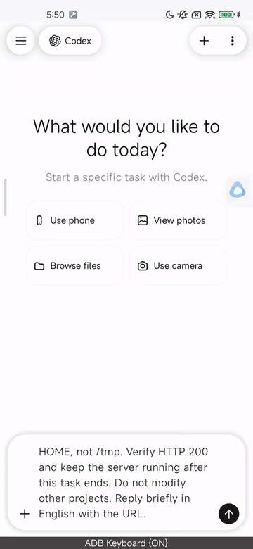

  

<h1 align="center">mobby</h1>

Ask about your screen, work with files, use apps, and write code on your phone.

English · <a href="docs/README.zh-CN.md">简体中文</a>

  <a href="#ask-about-whats-on-your-screen">Screen Q&amp;A</a> ·
  <a href="#work-with-photos-and-files">Photos and files</a> ·
  <a href="#let-it-use-apps-for-you">App control</a> ·
  <a href="#build-something-useful-on-your-phone">Coding on your phone</a> ·
  <a href="#getting-started">Getting started</a>

mobby runs coding agents such as Pi, Claude Code, Codex, and OpenCode directly on Android, with access to your screen, photos, and files. Use it as your personal AI assistant to understand a page, work with files, operate apps, or write and run code on your phone.

## Ask about what's on your screen

Reading a page you don't understand? Tap the floating button, open the floating chat, and use screen recognition. Ask mobby to translate the text, explain it, or answer a follow-up question.

> What is this page about? What makes Python useful, and where should a beginner start?

In this demo, mobby reads the Python website and answers in the floating chat.

## Work with photos and files

Add photo or file access to a task and choose the photos or folder to share. Ask mobby to describe an image, copy files, make a list, and save the results back to your phone.

> Look at my recent photos, copy the latest one to the folder I selected, and create an image summary and a file list.

This demo exports an image copy, a Markdown summary, and a CSV list, then reads them back to check their contents. The original image stays where it was.

## Let it use apps for you

Add phone access to a task and describe what you want to do. mobby reads the screen, taps buttons, types text, and moves between pages to carry out the steps.

> Install Via browser from the app store and open Bookmarks.

This demo installs Via from its page in the Xiaomi app store, completes the first-run setup, and opens Bookmarks from the browser menu. App control can still run into wrong taps or service interruptions, so keep an eye on the results of longer tasks.

## Build something useful on your phone

Describe what you need. Let the agent write the code in your phone's workspace, start a local server, and open the result in your browser.

> Make a travel packing list with categories for documents, clothes, electronics, and toiletries. Let me check off, add, and delete items, and keep my changes after a refresh.

Codex built this checklist on the phone. It shows your packing progress and saves items and checkmarks in the browser, ready to review before you leave.

[Browse the example code](docs/examples/travel-checklist-en/)

## Getting started

mobby currently supports ARM64 devices running Android 8.0 or later. On first launch, it sets up the runtime included in the APK. Enter your service URL, API key, and model in the gateway settings, save them, and start a conversation.

Screen Q&A requires the floating button, permission to display over other apps, and the screen accessibility service. Grant photo and file access for the tasks that need them. All four demos were recorded with Codex on an Android 13 phone; mobby, prompts, and replies are in English. Some Xiaomi store listings and vendor popups still contain Chinese text. See the [demo notes](docs/media/en/README.md) for the test results and known issues.

[Build and usage guide](docs/getting-started.md) · [Gateway setup](docs/gateway.md) · [Project docs](docs/README.md) · [MIT license](LICENSE)

The linked guides are currently in Chinese.
