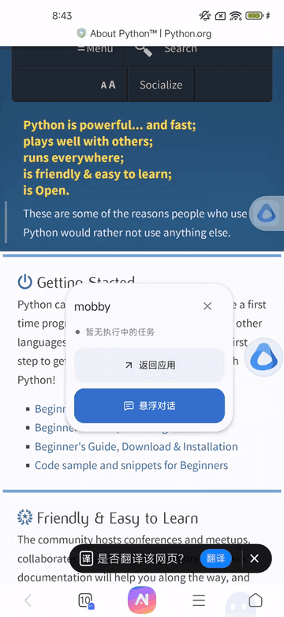
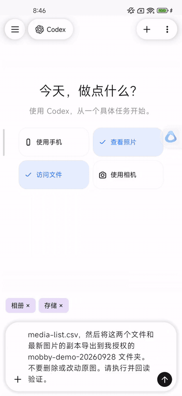
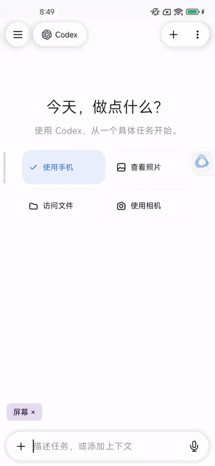
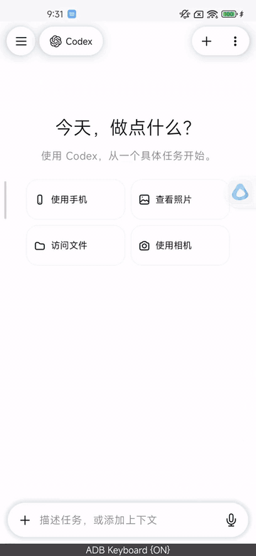

  

<h1 align="center">mobby</h1>

在手机上看页面、处理文件、操作应用、写程序。

<a href="../README.md">English</a> · 简体中文

  <a href="#看着页面直接问">页面问答</a> ·
  <a href="#处理手机里的照片和文件">照片与文件</a> ·
  <a href="#让它帮你操作-app">操作 App</a> ·
  <a href="#在手机上写个能用的小程序">手机编程</a> ·
  <a href="#开始使用">开始使用</a>

mobby 让 Pi、Claude Code、Codex、OpenCode 这些 Code Agent 直接在 Android 手机上运行，接入屏幕、相册、文件等手机能力，成为你的个人 AI 助手。你可以让它看懂当前页面、处理照片和文件、操作 App，也可以直接在手机上写代码、运行程序。

## 看着页面，直接问

浏览网页时遇到一段没看懂的英文，点开悬浮球，进入悬浮对话，再点“识别屏幕”。mobby 会读取当前页面，你可以让它翻译、解释，或者接着追问。

> 这个页面在讲什么？Python 有哪些特点，初学者应该从哪里开始？

## 处理手机里的照片和文件

给当前任务加入“查看照片”或“访问文件”，选好要开放的照片和目录，就可以让它识别图片、复制文件、整理清单，再把结果保存回手机。

> 看一下最近的照片，把最新一张复制到指定文件夹，再写一份图片说明和文件清单。

## 让它帮你操作 App

把“使用手机”加入任务，告诉它要去哪、做什么。它会读取屏幕，点击按钮、输入文字、切换页面，按步骤操作手机。

> 去应用商店下载番茄ToDo，打开添加待办的功能。

## 在手机上写个能用的小程序

说清楚想做什么，让 Agent 在手机工作区写代码、启动服务，再用手机浏览器打开。

> 做一个旅行打包清单，按证件、衣物、电子和洗漱用品分类。可以勾选、添加、删除，刷新后还能保留。

[查看示例源码](examples/travel-checklist/)

## 开始使用

目前支持 Android 8.0 及以上的 ARM64 设备。首次打开会初始化随安装包提供的运行环境；在网关设置中填写服务地址、API Key 和模型，保存后即可开始对话。

页面问答需要开启桌面悬浮球、悬浮窗权限和屏幕无障碍服务；照片与文件按任务授权。

[构建与使用](getting-started.md) · [网关设置](gateway.md) · [项目文档](README.md) · [MIT 许可证](../LICENSE)
