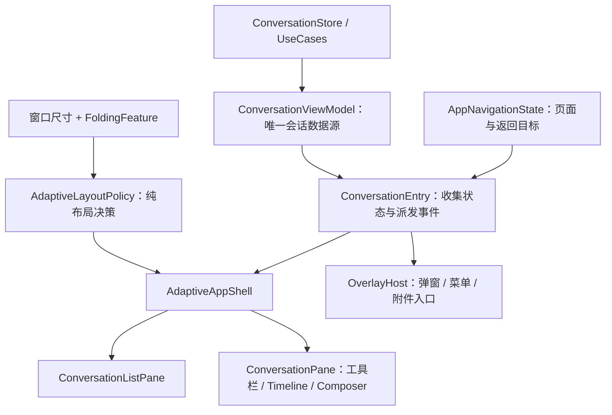

# 平板与折叠屏自适应界面重构方案

状态：待评审设计，尚未实施。代码核对及参考资料核对：2026-10-01。

## 1. 目标与边界

让现有 Compose App 在手机、平板、折叠屏内外屏、横竖屏及分屏窗口中保持完整可用，并在空间足够时同时展示会话列表与当前会话。判断依据是**当前 App 窗口及其可用区域**，不是设备型号或物理屏幕尺寸。折叠、展开、旋转和窗口缩放不能改变会话执行的语义，也不能丢失草稿、选中会话及阅读位置。

本次重构改变 `:app` 的窗口感知、页面组织与 Compose 布局，并在**同一次交付**中适配悬浮球和悬浮对话这两类独立窗口。保留内置 libtermux-android、Agent/Node 桥接、远端网关、会话仓库及加密配置的现有路径；不增加第二套会话数据库、执行控制器或平板专用 Activity。不变更 applicationId、Keystore 别名、数据库结构或 minSdk。主界面与悬浮窗口可分阶段实施，但须一同完成验收。

## 2. 已核对的现状

| 位置 | 当前行为及影响 |
| --- | --- |
| [`ConversationEntry.kt`](../../app/src/main/kotlin/com/github/ytlog/mobby/android/conversation/ui/ConversationEntry.kt) | 单一入口管理字符串 `route`、抽屉、弹窗及页面内容；`ConversationViewport` 读取 `BoxWithConstraints` 的宽高。抽屉宽度最多 360dp，打开时平移整张页面；会话时间线和输入区占满剩余窗口。没有宽窗或折叠特征分支。 |
| [`ConversationViewModel.kt`](../../app/src/main/kotlin/com/github/ytlog/mobby/android/conversation/ui/ConversationViewModel.kt) 与 [`ConversationState.kt`](../../conversation/domain/src/main/kotlin/com/github/ytlog/mobby/android/conversation/domain/ConversationState.kt) | 仓库状态已有会话列表、唯一 `selected` 会话和执行状态；UI 通过 `ConversationUseCases.select(id)` 选择会话。可复用为单栏和双栏的同一数据来源。 |
| [`MainActivity.kt`](../../app/src/main/java/com/github/ytlog/mobby/android/MainActivity.kt) 与 [`AndroidManifest.xml`](../../app/src/main/AndroidManifest.xml) | 单 Activity + Compose；Manifest 没有固定方向或禁止调整窗口大小的声明，`adjustResize` 已设置。此事实不等于各窗口尺寸已经验收。 |
| [`Theme.kt`](../../app/src/main/kotlin/com/github/ytlog/mobby/android/conversation/ui/Theme.kt) | `FrostedMenu` 按根视图宽度生成接近全窗宽的菜单。宽窗下需要按锚点及所在 pane 限宽和定位。 |
| [`FloatingConversationWindow.kt`](../../app/src/main/kotlin/com/github/ytlog/mobby/android/conversation/ui/FloatingConversationWindow.kt)、[`DesktopPet.kt`](../../app/src/main/kotlin/com/github/ytlog/mobby/android/conversation/ui/DesktopPet.kt) | 悬浮窗口通过 `displayMetrics` 计算尺寸和位置；折叠、分屏及显示区域变化需要单独验收。 |
| [`ConversationDrawerPageTest.kt`](../../app/src/test/kotlin/com/github/ytlog/mobby/android/conversation/ui/ConversationDrawerPageTest.kt) | 抽屉端到端 Compose 测试固定在 360×640dp；另有短横屏局部控件测试，尚未覆盖主界面的双栏或动态折叠。 |

## 3. 参考依据与采用方式

1. [Android 窗口尺寸类](https://developer.android.com/develop/adaptive-apps/guides/use-window-size-classes)：宽度分界为 compact `<600dp`、medium `600–839dp`、expanded `840–1199dp`、large `1200–1599dp`、extra-large `≥1600dp`；高度独立分类。尺寸类属于**应用窗口**且运行中可变。本文用它作高层候选，不把 840dp 当成无条件双栏开关。
2. [Android 列表详情布局](https://developer.android.com/develop/adaptive-apps/guides/list-detail)：宽窗同时显示列表和详情，窄窗逐个显示。`NavigableListDetailPaneScaffold` 提供一套可选实现及返回动画；项目已有仓库级选中状态和定制抽屉/预测返回，实施时须先验证能否将其导航状态与现有状态保持唯一，不直接再引入第二份选中会话。
3. [Android 折叠特征](https://developer.android.com/develop/adaptive-apps/guides/foldables/make-your-app-fold-aware)：Compose Material 3 Adaptive 可观察窗口信息与 `FoldingFeature`；`bounds`、`orientation`、`isSeparating`、`occlusionType` 用于避开铰链。不能把 `HALF_OPENED` 或精确折叠角度当成唯一判断条件。
4. [Android 自适应应用入门与测试](https://developer.android.com/develop/adaptive-apps/guides/get-started-with-adaptive-apps)：使用不同窗口尺寸、折叠模拟器和可调整窗口测试。模拟器布局通过不代替真实折叠设备的触摸、铰链和键盘验收。
5. [Android 方向、纵横比与窗口可调整性](https://developer.android.com/develop/adaptive-apps/guides/app-orientation-aspect-ratio-resizability)：窗口变化可能导致 Activity 重建；状态恢复必须纳入设计。当前项目 `targetSdk=35`，本方案不借界面重构顺带升级目标 SDK。

依赖选型在实施首阶段通过当前 Compose BOM、Kotlin/AGP 及 AndroidX 实际兼容版本确认并锁定。设计不指定未经构建验证的版本号，也不自行下载新 Android 系统镜像。

## 4. 建议架构

### 4.1 状态所有权

| 状态 | 所有者 | 恢复与切换规则 |
| --- | --- | --- |
| 会话列表、当前会话、草稿、执行进度、阅读锚点 | 现有 Repository / `ConversationViewModel` / UseCases | 保持现有存储与执行路径。两种布局都调用同一 `select(id)`；不能添加 `tabletSelectedId` 或并行执行控制器。 |
| 当前顶层页面、项目返回目标、待处理深链 | `AppNavigationState`，由 Activity 范围的 UI 状态持有并保存可恢复字段 | 取代散落的字符串 `route`/`projectsBackRoute`；切换宽度不修改目的地。深链仍选中原会话并进入会话目的地。 |
| 抽屉开关、菜单、局部弹窗 | UI 临时状态 | 抽屉只存在于单栏。转为双栏时关闭抽屉但不修改选中会话；返回单栏不自动打开。弹窗根据源 pane 重新定位。 |
| 当前窗口宽高、可用区域、铰链 | `AdaptiveAppShell` 的布局输入 | 每次窗口变化重新计算，不持久化“平板模式”；不进入 domain 或数据库。 |
| 时间线跟随意图、滚动位置、输入焦点 | 会话内容层及现有锚点机制 | 确保任一时刻只有一个 `ConversationPane` / `Timeline` 实例。布局切换造成重组时，恢复锚点与跟随意图，不触发再次发送或重建执行。 |

`AppNavigationState` 建议以有限的类型化目的地表示现有页面（会话、项目列表/详情、设置及子页），再以明确返回规则替代字符串比较。先把当前路由一一映射并保持手机行为，再让宽窗 shell 消费该状态；不在本次引入新导航框架或重写全部页面。`"add"` 当前是会话上的操作面板，应建模为 overlay，而非能够在双栏中占用详情 pane 的顶层目的地。

### 4.2 组件与职责

- `AdaptiveWindowSnapshot`：仅包含当前窗口可用尺寸和归一化到 **App 内容坐标** 的分隔区域；平台 `FoldingFeature.bounds` 转换必须考虑根视图位置、系统栏和密度，不把屏幕坐标直接用于 Compose pane。
- `AdaptiveLayoutPolicy`：输入可用区域、宽高尺寸类和最小 pane 尺寸，输出 `SinglePane`、`SideBySide` 或 `SeparatedByHinge`，以及各 pane 的区域。作为纯函数单测，不读取设备型号。
- `AdaptiveAppShell`：负责安放列表、详情与全屏子页。将现有抽屉位移、边缘滑动、预测返回封装进 `CompactConversationShell`；宽窗的 `WideConversationShell` 固定展示列表，不挂载抽屉滑动处理。
- `ConversationListPane`：从现有 `ConversationDrawer` 抽出列表、搜索、置顶、项目入口和页脚；窄窗外层保留抽屉背景及开关行为，宽窗外层提供固定 pane 和选中态。不会出现两份同时订阅并写入的列表。
- `ConversationPane`：复用 `Timeline`、`Composer` 和工具栏逻辑。列表点击只更换当前会话；单栏时收起抽屉，双栏时原位更新详情。详情内部给消息和输入区设置可阅读的最大宽度，并在 pane 中居中。
- `OverlayHost`：按源 pane 的可用矩形安放新建会话、更多菜单、阅读器、附件面板等。窗口窄时保留当前 sheet/dialog 交互；宽窗时限制宽度并确保关闭入口、IME 避让和铰链避让。先修正 `FrostedMenu` 的全窗宽假设。

采用 Material 3 Adaptive 的窗口/折叠信息；列表详情 scaffold 是否用于实际排版，在第一阶段做小范围验证。选择标准是：能否复用现有唯一 `selected`、保持手机抽屉预测返回和深链语义、避免双重导航栈。若不能，使用上述本地 shell 与纯布局策略；不同时保留两套职责重叠的导航实现。

### 4.3 悬浮窗口的独立边界

悬浮球与悬浮对话由 `WindowManager` 管理，位置属于它们所在显示区域，不能直接复用 Activity 内容区域的 `AdaptiveLayoutPolicy` 或坐标。保留现有共享会话、草稿和执行路径；在浮窗层单独处理当前显示区域变化：重新计算对话窗的宽高上限与 IME 可用高度，将持久化的悬浮球位置约束到新区域，并在折叠、展开、旋转及分屏后重新检查可触达性。设备提供可用的分隔或遮挡信息时，浮窗的触控控件避开该区域；无法取得可靠信息时，以当前可用窗口边界约束并通过设备验收记录限制。悬浮窗重新挂载后继续显示同一会话的真实状态，不重建任务或清除草稿。主界面和悬浮窗口都完成这些要求，才算本方案交付完成。

## 5. 布局规则初稿

| 窗口与铰链 | 拟议行为 |
| --- | --- |
| 宽度 `<600dp` | 当前单栏与抽屉。 |
| `600–839dp` | 保持单栏，不要求竖屏平板常驻会话列表；限制内容宽度，并在短横屏或键盘占据大量高度时保证滚动及主要操作可达。 |
| 宽度 `≥840dp` 且高度足够、左栏和详情均满足最小宽度 | 固定左栏 + 详情。初始设计取左栏约 320dp、pane 间距 16dp、详情至少 480dp；实际宽度以可用窗口与字体缩放实测调整。消息/输入内容在详情内限制最大宽度，不让长行铺满大屏。 |
| 竖向分隔铰链 | 优先把列表和详情分别置于两侧；只在两侧都满足最小宽度时启用双栏。铰链及安全间距不承载文字、输入或触控目标。若一侧不足，单栏显示在可用的一侧，另一侧不放交互元素。 |
| 横向分隔铰链、半折叠桌面姿态 | 首版只保证安全可用：当前会话主要操作位于完整可用区域，输入区不跨铰链，时间线可滚动。不设计上下分工的专门桌面姿态体验。 |
| 无分隔折痕或普通平板 | 根据窗口可用宽高选择单栏/双栏，折痕不能成为布局强制开关。 |

上述尺寸是**设计初值**，需要结合现有 360dp 消息气泡上限、字体缩放、触控目标和实机空间校准。`AdaptiveLayoutPolicy` 还必须使用实际 pane 可用宽度和高度：840dp 的短窗口或带大铰链窗口不保证双栏。项目和设置等非会话页面首版在主内容区显示并限制表单宽度，不为每个子页另造双栏。

## 6. 返回、生命周期与执行连续性

1. 单栏保留现有返回顺序：先关闭弹层/抽屉，再按当前页面返回；双栏切换会话不压入一串“上一会话”返回记录，系统返回处理当前页面或弹层。两种形态共享同一个目的地状态，窗口变化本身不新增返回记录。
2. `ConversationEntry` 中的 `rememberSaveable` 状态按实际语义迁入 `AppNavigationState` 或局部组件；配置变化后还原页面、必要的弹窗和待处理文件选择目标。已有 Repository 草稿和阅读锚点继续作为持久来源；特别验证 Activity 重建时的跟随意图。
3. 运行任务由原有执行层管理。旋转、折叠或双栏切换只能重新订阅状态，不能重新提交 prompt、取消任务、伪造成功或重复触发权限/附件操作。
4. 窄宽切换时避免同时组合 compact 与 wide 两套完整会话树。必要时在同一个稳定的会话组件中切换父布局，或先保存并恢复局部阅读状态；测试以实际可见消息和草稿为准。
5. 菜单锚点、IME、系统栏和无障碍焦点在新的 pane 坐标系下重新测量；弹层关闭后焦点回到触发控件。大字号与短窗口下操作入口必须可滚动到达。

## 7. 实施顺序与评审检查点

| 阶段 | 交付内容 | 完成判据 |
| --- | --- | --- |
| A. 固定手机基线 | 提取当前导航规则与可观察的抽屉/返回行为测试；记录草稿、深链、运行中会话和阅读位置样例 | 原手机行为测试通过，明确后续重构不得改变的协议。 |
| B. 整理状态与组件 | 类型化页面状态；抽出 `ConversationListPane`、`ConversationPane`、`OverlayHost`，手机仍使用原抽屉 | 无重复会话状态或执行路径；现有 UI/单元测试通过。 |
| C. 宽窗布局 | `AdaptiveLayoutPolicy`、双栏 shell、内容限宽、固定列表选中态与宽窗菜单 | 360/600/840/1200dp 等边界宽度测试通过，分屏拖动时不裁切、不重复发送。 |
| D. 折叠感知 | 接入窗口折叠特征、铰链区域变换与回退规则 | 竖/横向分隔、遮挡与非遮挡折痕的布局测试通过；模拟器实际折叠路径验收。 |
| E. 同次交付的悬浮窗口与最终验收 | 悬浮球/悬浮对话尺寸定位、位置恢复、键盘、无障碍及真实设备核查 | 主界面与两类浮窗在可获得设备上均不越界、可触达且共享会话状态连续；构建、lint、相关测试通过，并报告设备覆盖缺口。此阶段是本方案交付门槛，不留给另一次改造。 |

对可复现的原有缺陷先写失败回归再修复；新增布局规则使用纯单元测试，交互用 Compose 测试，铰链坐标、IME、预测返回和重建用设备测试。使用现有连接手机和已有模拟器，不自行下载 Android 系统镜像。相关构建按项目约定使用 JDK 17 执行 `./gradlew :app:assembleDebug :app:testDebugUnitTest :termux-core:testDebugUnitTest :app:lintDebug`。模拟器及假数据通过不等同于真实折叠硬件验收；无硬件时明确列为未验证范围。

## 8. 已确认的范围决定

1. 首版中等宽度（600–839dp）保持单栏，不要求竖屏平板常驻列表；双栏从满足 pane 最小尺寸的 expanded 窗口开始。
2. 半折叠横向铰链仅保证安全可用，首版不纳入桌面姿态的专门体验。
3. 悬浮球和悬浮对话必须与主界面自适应改造同次交付并共同验收。

单一会话数据源、按窗口而非设备分类、铰链避让和执行连续性均为架构约束。
