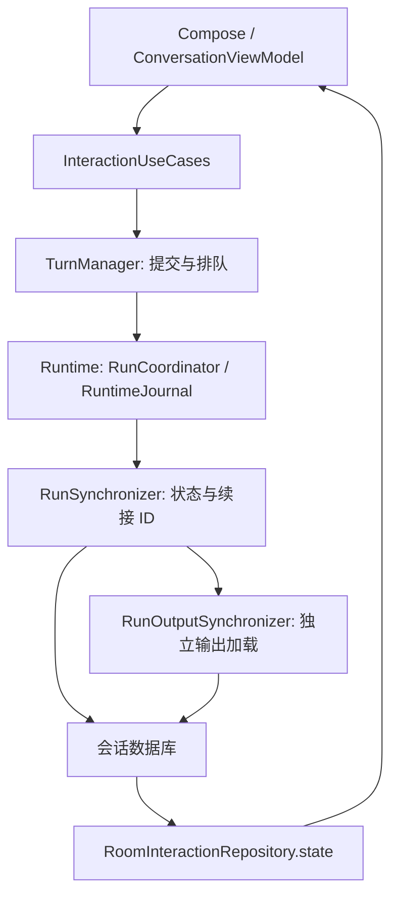

# 会话运行状态管理

## 状态归属

`RunCoordinator` 与 `RuntimeJournal` 保存真实任务的状态和终止证据。会话数据库中的快照和 `occupied` 是可恢复的投影，不是第二套执行状态机。界面通过 `RoomInteractionRepository.state` 读取这些投影，不能自行推断任务成功、取消或进程退出。

`runtime-api/RunStateRules` 统一解释占用与显示结果：结果未知且未确认进程退出时继续占用；确认退出后解除占用，但不把未知结果改为成功。运行日志、会话投影、缓存清理和提交结果转换共用这套规则。

本地待提交、排队、草稿状态属于会话层；任务接纳后，运行状态只能来自 Runtime。既有数据库结构保持不变。

## 职责与数据流

- `ConversationManager` 管理会话身份、配置、选择和可见性。
- `TurnManager` 管理提交记录、队列和展开状态，运行同步委托给 `RunSynchronizer`。
- `RunSynchronizer` 是接纳后的 Runtime 快照投影写入入口。停止后的直接刷新、事件订阅和重连恢复均通过同一事务保存快照、占用和对应引擎的续接 ID。旧序列不能覆盖新状态。
- `RunOutputSynchronizer` 按任务独立加载输出；同一任务合并唤醒请求，并从会话数据库读取最新已保存快照，成功后结束已释放任务的加载协程。读取失败或超时保留缓存并退避重试；它不能改写运行状态或续接 ID。打开应用后也恢复已经结束但输出尚未完整加载的任务。
- `MessageManager` 把状态和已经加载的内容转换为界面模型。任务错误、输出同步警告分开表达；输出无法读取不会伪造成功，也不会阻塞已确认的结束状态。

## 一致性约束

1. 快照、占用和续接 ID 原子更新后才能调度下一条消息；输出读取不参与这个事务。
2. 活跃订阅异常时从已保存游标重新订阅，必要时以完整快照替换投影；不能因一次异常永久停止观察。
3. 会话摘要存在占用任务时，状态、停止目标和设备操作均选自同一个占用任务。没有占用任务时才显示最新消息的结果。
4. 输出清理墓碑优先于迟到下载，过期内容不能复活为可用缓存或可保存的技能草稿。
5. 已结束任务的输出恢复与活跃任务恢复分别执行；输出异常不能占住执行槽。

## 验证范围

回归覆盖输出阻塞期间的任务结束、续接与队列调度，输出不可用后的自动重试，订阅短暂异常后的恢复，应用重开后的终态输出恢复，摘要选择，旧序列防覆盖，输出请求乱序回放，以及迟到下载与清理墓碑。单元测试使用隔离数据库和模拟 Runtime；真实 Agent 与网关仍须单独验收。
