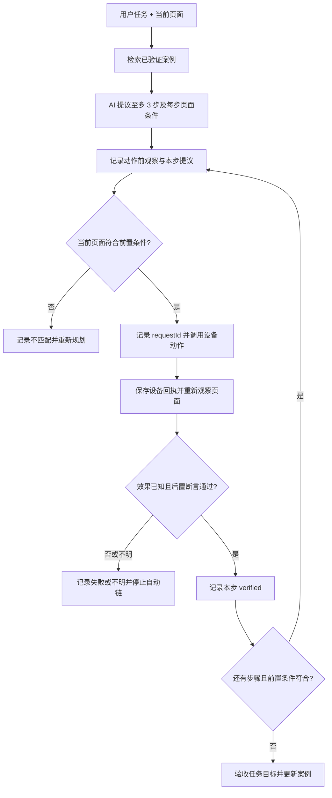

# 手机操作历史与多步执行协议（设计提案）

状态：待实施。本文定义记录、检索和执行的共同协议；下文 JSON 是目标格式，不代表当前 App 已支持批量操作或长期学习。适用范围为本轮已授权的 `plugin:device:screen` 操作。其他设备插件可复用外壳，但必须分别定义观察与验收；Shell/CLI 命令不在本协议的自动重放范围。

## 1. 要记录什么

一次任务保存为 `task`，每次实际设备动作保存为 `step`。`step` 不是一句「点击成功」，而是一组可以追责的事实：**动作前看到了什么、原计划是什么、实际向 Android 发了什么、执行器确认了什么、动作后看到了什么、是否达到预期**。失败、取消和效果不明的尝试也保存，但不进入可复用流程。

现有 `mobby.device/1` 的 `DeviceOperation` 继续服务当前运行的操作卡、状态和去重。它的 `input` 是展示用投影，不等于完整 `args`；`screen_observation` 是动作后的一次观察，截图资源还可能被缓存淘汰。因此历史协议使用独立私有库，不能靠现有操作卡反推可执行记录，也不改变现有桥接请求含义。现有 `requestId` 去重只覆盖当前 run；历史流程每次执行都生成新的请求 ID。

### 记录模型 `mobby.workflow-history/1`

| 实体 | 必需字段 | 含义 |
| --- | --- | --- |
| `task` | `id`, `runId`, `goalTemplate`, `createdAt`, `endedAt?`, `outcome`, `steps[]` | 一次用户任务；`outcome` 为 `running/verified/failed/cancelled/unknown`，`goalTemplate` 是脱敏后的目标描述，不保存完整对话。 |
| `observation` | `id`, `capturedAt`, `packageName`, `windowSignature`, `visibleElements`, `quality` | 一次真实读取；`visibleElements` 只保留匹配所需的角色、短标签、可点击性和稳定定位线索；`quality` 标示空树、截断、受保护窗口等。 |
| `step` | `id`, `taskId`, `index`, `beforeObservationId`, `proposal`, `dispatch`, `receipt`, `afterObservationId?`, `verification`, `state` | 一次实际尝试。`index` 单调递增；不能以新请求 ID 静默重复效果不明的动作。 |
| `proposal` | `action`, `target`, `expectedAfter`, `confidence` | AI 在执行前的猜测。`expectedAfter` 是可观测断言，不是「应该成功」这种结论。 |
| `dispatch` | `operationId`, `requestId`, `plugin`, `action`, `argTemplate`, `argsDigest`, `sentAt` | 实际被桥接接受的动作身份、参数模板和原始参数摘要。敏感原值不写入历史。 |
| `receipt` | `status`, `effectState`, `errorCode?`, `finishedAt` | 来自现有设备执行协议的事实；`accepted` 只能说明受理，不能说明目标页面已出现。 |
| `verification` | `verdict`, `checks[]`, `checkedAt`, `reason?` | 独立比较动作前后真实观察与预期；值为 `passed/failed/indeterminate`。 |

`windowSignature` 是本地归一化特征，如包名、窗口类型、稳定的控件角色和标签集合；不是整页文本的哈希。动态列表、时间、广告位变化不应导致匹配失败；也不能只凭包名判定同一页面。`visibleElements` 对密码框不记录文本，对短信正文、联系人、通知、搜索输入等用户内容默认不记录原文。归一化和敏感分类在落盘前执行；无法安全分类就标记该观察不可学习。

一个非敏感的示例（省略数据库行 ID 与时间）：

```json
{
  "schema": "mobby.workflow-history/1",
  "task": {"id": "task-1", "runId": "run-1", "goalTemplate": "在当前应用搜索{keyword}", "outcome": "verified"},
  "step": {
    "id": "step-1", "index": 1,
    "before": {"packageName": "com.example.store", "windowSignature": "store:home:search-entry", "visibleElements": [{"role": "button", "label": "搜索", "clickable": true}], "quality": "complete"},
    "proposal": {"action": "screen.click", "target": {"label": "搜索"}, "expectedAfter": [{"role": "edit_text", "visible": true}], "confidence": 0.82},
    "dispatch": {"operationId": "op-1", "requestId": "req-1", "plugin": "screen", "action": "click", "argTemplate": {"query": "搜索"}, "argsDigest": "sha256:..."},
    "receipt": {"status": "succeeded", "effectState": "confirmed"},
    "after": {"packageName": "com.example.store", "windowSignature": "store:search:empty", "visibleElements": [{"role": "edit_text", "label": "搜索商品", "clickable": true}], "quality": "complete"},
    "verification": {"verdict": "passed", "checks": [{"kind": "element_visible", "role": "edit_text"}]},
    "state": "verified"
  }
}
```

`receipt.effectState=confirmed` 在屏幕动作中表示 Android 执行器确认点击/手势完成；示例的 `verification=passed` 才说明预期输入框出现。两者独立。截图不属于持久历史，原有 `observationRef` 只供本轮排错；资源消失不改变已保存的结构化判断。

## 2. 写入协议与状态

历史库由应用进程写入。Agent 只能提交候选计划及调用现有设备桥接，不能直接写「已成功」或改写回执。每个事实带来源：`model_proposal`、`device_receipt`、`accessibility_observation`、`local_verifier`。读历史供模型参考时，它是数据，不是新的系统指令。

1. 开始任务，持久化 `task(running)`。读取当前页面，落盘 `before`；读取失败则记录 `quality=unavailable`，不预测点击。
2. AI 一次产生最多 3 个候选步骤，格式为 `action + target + expectedAfter + precondition`。这是预测队列，不是已执行记录。应用先校验当前插件授权、动作白名单、目标是否可定位；首步通过才进入派发。
3. 在派发前持久化 `step(proposed)`、前置观察 ID 与唯一 `requestId`；绑定现有操作的 `operationId` 后写 `dispatched`。如果历史库写入失败，停止自动链。实际动作仍由 `mobby.device/1` 执行和去重。
4. 保存执行器返回的终态与 `effectState`。超时或连接断开时用原 `requestId` 查本轮 `operation.status`；仍不明则记 `unknown` 并停止。不能换 ID 重发写动作。
5. 动作结束后重新读取页面，保存 `after`。按 `expectedAfter` 验证包名、窗口特征及所需控件；如果观察缺失或质量不足，记 `indeterminate`，不声称成功。
6. 仅当回执允许成功判断且验证通过，记 `verified`，再检查预测队列中的下一步前置条件。页面不符、目标多义、权限变化、取消或用户手动改变页面时结束此队列并让 AI 根据最新页面重规划。
7. 任务结束时单独验收目标，写 `task.outcome`。步骤全部通过仍不自动等于任务完成；例如搜到商品列表不等于完成下单。只有任务目标和相关步骤均验证通过，才提取可复用案例。

记录写入需保持事实顺序和崩溃恢复：任务/步骤/观察在同一私有 SQLite 库中按事务追加，状态只能前进，终态不可被模型覆盖。重启后把未完成步骤核对现有 `operation.status`；无法确定的保留 `unknown`，不自动续跑。`operationId`/`requestId` 只用于关联当轮执行，不作为跨任务去重键。历史写入不能干扰现有操作卡；若在派发前失败则不执行该步，派发后失败则停止后续步骤并如实保留设备操作结果。

## 3. 可复用流程与检索

从已验收任务抽取独立的 `case`：`caseId`、规范化目标、应用包名、入口页面特征、参数槽、按序步骤模板、每步前置条件与后置断言、来源 `taskId`、成功次数、失败次数、最近验证时间、协议版本。原始历史是证据；`case` 是可删除、可重新生成的派生索引。没有足够证据时只保留历史，不生成案例。一次成功可以生成候选案例，但默认需要再次成功验证后才提升检索优先级。

新任务先按目标、当前应用和页面特征检索少量案例。AI 可据此提议多个后续步骤，但只执行当前页面已验证的一步；每步后重新观察并验证下一步的前置条件。候选案例与当前 UI 不一致时直接舍弃，不用旧坐标硬点。`screen.tap` 的坐标与屏幕尺寸、旋转和布局绑定，首版案例只复用语义目标（如可见控件标签），不复用裸坐标。输入文字用 `{keyword}` 等槽位，运行时从当前用户请求绑定；缺值就停止，不从历史拿旧值。



图中的循环每次都必须重新经过真实页面校验；候选计划中的第 2、3 步不会因为上一动作的点击回调成功而自动执行。

## 4. 私有存储、权限与清理

- 新建独立的应用私有 `workflow-history.db`。开发期表结构改变时只重建这个开发数据库；现有 `runtime-journal.db`、SharedPreferences、HOME 与工作区不动。历史记录、案例、观察、步骤分别建表；`taskId + index`、`runId + requestId` 唯一，使用外键和事务。SQLite 中只存脱敏结构与必要索引，原始敏感参数不持久化。
- 首版默认只记屏幕操作的脱敏结构。原始页面树、截图、密码、短信正文、电话号码、令牌、完整命令行、Agent 提示和模型内部推理不进入长期库。`screen.type` 的原值默认只记槽位类别/长度/摘要，不作为案例文本。哈希不能充当匿名化：短词、号码仍可猜测，因此敏感内容不存可离线枚举的摘要。
- 历史默认保留 30 天、上限 32 MiB，案例最多 100 条；超限先清理最旧非活跃任务及其观察，再删失去来源的案例。用户可在设置中查看、按任务删除、全部清空或关闭学习；关闭后不新增案例，已有历史可清空。历史库不进入自动备份或云同步。实际产品设置与现有事件保留设置分开标注，避免误认为清理运行日志就清理了学习记录。
- 每次复用仍检查当轮 `plugin:device:screen` 引用、系统无障碍权限、停止状态和设备操作白名单。历史不会扩大权限；现有写入插件的独立引用规则也不变。用户删除历史后，案例和检索索引同步删除。

## 5. 实施边界与验收

1. 先落地纯 Kotlin `workflow-history/1` 数据模型、状态机与脱敏规则，独立 SQLite 存储；接入当前 `DeviceOperationPort` 的可信回执，不能从 CLI 文本或展示卡倒推结果。
2. 为 `screen.snapshot` 和动作后的新鲜观察接入结构化采集。现有 `ScreenAccessService` 的 `Observation.text` 是可读文本，缺稳定控件 ID；需要补充可匹配的元素描述并约束数量，采集不到时明确降级为 `indeterminate`。
3. 做单步记录与验收，再做候选流程检索、参数槽与逐步校验。多步预测先只支持 `snapshot/click/type/back`；是否允许 `home/recents/tap` 进入案例须按观察能力单独验收。保持现有逐动作桥接，不新增一次性盲执行的批量命令。
4. 测试覆盖：前后观察区别、点击成功但页面未达预期、模糊目标、敏感值不落盘、未知副作用不重发、崩溃恢复、删除联动、授权撤销、布局变化后停止。真机用至少两个实际页面验证复用与界面变化后的停止；模拟测试不能代替真机验收。

本协议记录的“命令”是具体设备动作及其参数模板。若以后要求复用 Agent 在 Shell 中执行的命令，需要先建立单独的可信命令来源、作用域和敏感参数分类；当前终端输出与运行命令回执不足以证明任意 Shell 命令可以安全重放。
