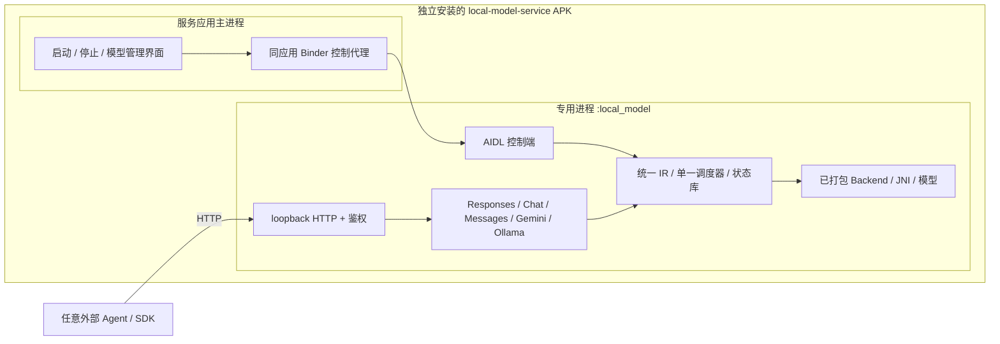

# 本地模型 Gradle 模块、独立进程与 HTTP API 设计

状态：设计提案 v4，尚未实现。资料核对：2026-09-24。

交付目标：独立安装的 Android 模型服务应用 **`:local-model-service`**，由它自己的 **`:local_model` 专用进程**运行 HTTP 服务、协议适配、调度及模型推理。`:local-model` 是该服务专用的 Android Library。服务与现有 mobby App、Node 桥接和 Agent 功能无运行时关系：独立 applicationId、UID、数据目录、密钥与生命周期；外部客户端仅通过 HTTP 接入。引擎调研见[引擎目录](local-model-engines.md)。

## 1. 当前决定与范围

按用户最新要求，HTTP API 是正式主入口：提供 OpenAI Responses、Chat Completions、Anthropic Messages、Gemini generateContent 和 Ollama chat/generate 五组协议适配器。**协议支持由本模块提供，不再要求引擎自带同名 HTTP 协议。** Kotlin API 仅用于独立服务应用内部控制和调用，复用同一个执行核心。

本服务独立实现各 HTTP 协议到统一推理请求的语义适配，再按原协议输出。现有 mobby 网关的透传规则只约束原 App，与本服务无调用关系。支持自定义本地 HTTP endpoint 的 Agent 可作为外部客户端接入，具体兼容性须实测；本方案不修改现有 Agent 配置。工具、图片、推理或未知字段不得被静默丢弃；无法表达的语义在执行前拒绝。

模型、引擎、协议、Agent 四个维度分开：Gemma/Phi/Qwen 是模型，LiteRT-LM/ONNX GenAI 等是引擎，Responses/Messages 是协议，Codex/Claude Code 等是客户端。适配器不能使文本模型自动具备视觉、工具或推理能力。对具体组合按能力报告启用，目标是多 Agent 兼容，而不是声称完整复刻所有厂商云服务。

首个闭环交付 llama CPU、模型管理、独立服务进程、三组核心协议（Responses/Chat/Messages）、文本与经验证的 function tools；Gemini/Ollama 协议在同一设计中列为必交付的后续适配器。引擎目录均纳入架构，按构建选配，不一次把全部 native 库打进 APK。不训练模型、不运行任意下载的代码、不自动回退云端。

## 2. 现状与设计依据

当前 [settings.gradle.kts](../../settings.gradle.kts) 尚无这些模块，本文所有 Gradle、AIDL、Manifest 与 API 均为拟议结构。新服务在同一仓库构建，但不依赖 `:app`、`runtime-*`、`interaction-*` 或旧配置；最低 API、ABI、NDK 和 SDK 由新服务自身与实际打包引擎决定，不从旧 App 推定。研究细节、官方链接及 Android 支持证据见[引擎目录](local-model-engines.md)。以下资源额度和超时均为拟议默认值，须真机校准。

## 3. Gradle 模块设计

### 3.1 对外入口与内部模块

`:local-model-service` 是唯一可安装应用及控制入口；它依赖 `:local-model`，后者封装服务实现与后端组合。现有 `:app` 不依赖这些模块；第三方客户端只使用 HTTP API，不需要链接 AAR。

| 模块 | 类型 / 职责 | 依赖 |
| --- | --- | --- |
| `:local-model-service` | 独立 Android Application，启动/停止与模型管理界面、独立 applicationId、Manifest、前台服务声明 | `:local-model` |
| `:local-model` | Android Library，服务实现、同应用 Binder 控制、HTTP listener、安装存储及进程组合根 | api、core、http；按构建配置选择 backend |
| `:local-model-api` | Kotlin/JVM，模型/任务/事件 DTO、能力、错误、Backend SPI | coroutines、serialization；无 Android/Compose/CLI 依赖 |
| `:local-model-core` | Kotlin/JVM，唯一调度器、模型租约、生成与协议会话状态机 | api |
| `:local-model-http` | Kotlin/JVM，路由、五组协议 codec、SSE/NDJSON、鉴权和准入；嵌入式 server 传输封装 | api、core；Android 可用的 HTTP server 实现 |
| `:local-model-backend-<id>` | Android Library，厂商 SDK/JNI 的封装，向 core 注册 factory | api；固定 SDK/NDK 依赖，不反向依赖 local-model |

`llama`、`litert-lm`、`onnx-genai`、`mlc`、`executorch`、`mnn` 等后端 ID 与引擎目录一致。候选项未实现时不创建假 adapter，目录可以列出但 `packaged=false`。HTTP 服务建议采用 Android 可用的嵌入式 JVM server（先验证 Ktor CIO 的固定版本）；选型必须兼容项目 Kotlin/AGP，不用动态版本或直接升级全项目来迁就 SDK。HTTP 框架封装在内部，不进入公共契约。

```text
local-model/
  build.gradle.kts
  consumer-rules.pro
  src/main/aidl/.../ILocalModelControl.aidl
  src/main/aidl/.../ILocalModelObserver.aidl
  src/main/kotlin/.../LocalModelHost.kt          # 主进程代理，无 native 初始化
  src/main/kotlin/.../service/LocalModelService.kt
  src/main/kotlin/.../service/ServiceComposition.kt
  src/main/kotlin/.../service/LocalModelNotification.kt
  src/main/kotlin/.../ipc/                      # bounded DTO / FD
  src/main/kotlin/.../storage/                  # 子进程唯一写入者
local-model-api/src/main/kotlin/.../            # DTO、SPI、错误
local-model-core/src/main/kotlin/.../           # 调度器、状态、租约
local-model-http/src/main/kotlin/.../
  server/                                      # listener / auth / limits
  protocol/{responses,chat,messages,gemini,ollama}/
local-model-backend-llama/src/main/{kotlin,cpp}/
local-model-backend-litert-lm/                  # 后续可选
local-model-backend-onnx-genai/                 # 后续可选
local-model-service/
  build.gradle.kts
  src/main/AndroidManifest.xml
  src/main/kotlin/.../LocalModelApplication.kt
  src/main/kotlin/.../ServiceControlActivity.kt
```

### 3.2 Gradle 接入片段

以下是实施时的结构示例，尚未写入实际构建；其余 backend 按同样模式增加。首版只注册已实现的 llama，SDK 版本由统一的版本锁定文件提供。

```kotlin
// settings.gradle.kts（首个实施阶段）
include(":local-model-service", ":local-model", ":local-model-api", ":local-model-core", ":local-model-http")
include(":local-model-backend-llama")

// local-model-service/build.gradle.kts
// plugins { id("com.android.application"); kotlin("android") }
// android { namespace = "com.github.ytlog.mobby.localmodel.service"
//           defaultConfig { applicationId = "com.github.ytlog.mobby.localmodel.service" } }
// dependencies { implementation(project(":local-model")) }

// local-model/build.gradle.kts
plugins { id("com.android.library"); kotlin("android") }
android {
    namespace = "com.github.ytlog.mobby.localmodel"
    compileSdk = 35
    defaultConfig {
        minSdk = 26
        consumerProguardFiles("consumer-rules.pro")
        ndk { abiFilters += "arm64-v8a" }
    }
    buildFeatures { aidl = true }
    compileOptions {
        sourceCompatibility = JavaVersion.VERSION_17
        targetCompatibility = JavaVersion.VERSION_17
    }
    kotlinOptions { jvmTarget = "17" }
}
dependencies {
    api(project(":local-model-api"))
    implementation(project(":local-model-core"))
    implementation(project(":local-model-http"))
    implementation(project(":local-model-backend-llama"))
}
```

`:local-model` 通过构建生成的 `BackendRegistry` 显式注册选中的 factory；禁止扫描类路径时加载全部 JNI 库。新服务的构建配置只能选择已注册 ID；未知/未实现 ID 构建失败。所选高 minSdk 引擎使用高版本发行变体或符合上游要求的独立交付，不用 `tools:overrideLibrary` 强行合并。只下载权重不会解决缺失 native adapter，未打包后端须提示安装相应应用版本。

每个后端独立锁定 SDK、CMake/NDK、STL 与编译产物校验和。共享库冲突必须重命名/隐藏符号或分构建变体解决，不能 `pickFirst` 任意取一个 `libc++_shared.so`。同进程内同时装入不同 SDK 的兼容性必须验证；默认只加载一个后端，切换可能有全局符号冲突的后端时先排空任务并重启服务进程。

### 3.3 调用和进程图



HTTP 流不经过服务应用主进程或 Binder。主进程只提供本服务的控制界面；模型安装、推理由专用进程唯一执行。现有 mobby App 不在此链路中，也不因同仓库构建而自动获得服务权限。

## 4. 独立进程与 Android 生命周期

### 4.1 Manifest 与初始化

```xml
<manifest xmlns:android="http://schemas.android.com/apk/res/android">
    <uses-permission android:name="android.permission.INTERNET" />
    <uses-permission android:name="android.permission.FOREGROUND_SERVICE" />
    <uses-permission android:name="android.permission.FOREGROUND_SERVICE_SPECIAL_USE" />
    <uses-permission android:name="android.permission.POST_NOTIFICATIONS" />
    <application>
        <service
            android:name="com.github.ytlog.mobby.localmodel.service.LocalModelService"
            android:process=":local_model"
            android:exported="false"
            android:stopWithTask="false"
            android:foregroundServiceType="specialUse">
            <property android:name="android.app.PROPERTY_SPECIAL_USE_FGS_SUBTYPE"
                android:value="User-started on-device model inference HTTP service for local agent clients, with a persistent stop notification." />
        </service>
    </application>
</manifest>
```

Manifest 由独立的 `:local-model-service` 应用声明。冒号进程名创建该应用私有命名的独立进程；它与服务控制界面同 UID/SELinux，却与现有 mobby App 分属不同 UID/数据目录。不启用 `isolatedProcess`，不需要 root。独立进程隔离崩溃，不隔离同 UID 文件访问，HTTP loopback 也不具备 UID 鉴权。[Android 进程说明](https://developer.android.com/guide/components/processes-and-threads)

后台 HTTP 服务由用户在可见界面启动，采用适用的前台服务与常驻停止通知；`specialUse` 需要用途说明，分发渠道另有审核要求，不能把声明当作无限后台运行保证。启动条件不满足则返回 `BACKGROUND_START_NOT_ALLOWED`，不偷偷维持线程。[前台服务类型](https://developer.android.com/develop/background-work/services/fgs/service-types#special-use)

`LocalModelApplication` 必须先识别当前进程：控制主进程初始化服务界面；`:local_model` 只做轻量应用初始化，组合根由 Service 创建。App Startup/ContentProvider 和第三方 SDK 自动初始化须检查并禁用不需要的进程行为。任何后端不得在静态初始化或 Application 全局容器中调用 `System.loadLibrary`。API 26/27 进程名读取由平台适配处理，不假设 API 28 的方法始终可用。

### 4.2 控制接口与进程协议

```kotlin
interface LocalModelHost {
    val state: StateFlow<ServiceSnapshot>
    suspend fun start(config: ServerConfig): LmResult<ServiceLease>
    suspend fun connection(lease: ServiceLease): LmResult<ConnectionHandle>
    suspend fun stop(lease: ServiceLease, mode: StopMode): LmResult<Unit>
    suspend fun restartWhenIdle(): LmResult<ServiceSnapshot>
}
```

`ServiceLease` 包含 `serverInstanceId` 和 owner，防止旧页面停止新实例；`ConnectionHandle` 含 loopback 地址、协议 profile 和可消费秘密令牌，禁止 data-class 默认打印令牌。服务启动幂等、绑定成功不等于 HTTP 就绪；listener 已绑定、调度器和鉴权可用后才进入 LISTENING。

AIDL 只提供 `getSnapshot`、`start/configure`、`requestStop`、`registerObserver`、`unregisterObserver`、受控文件导入以及管理命令。每个命令带契约版本、commandId、instanceId；采用立即回执 + 异步状态，Binder 线程不阻塞模型加载。DTO 有长度限制（建议单笔 ≤ 64 KiB）；文件通过只读 FD，回调仅发有界摘要。binder 端还验证调用 UID 与会话实例。

状态机：`STOPPED → STARTING → LISTENING → DRAINING → STOPPED`，可进入 FAILED。LISTENING 表示可处理 HTTP，不表示所有模型已 READY；每个模型保有独立状态。

### 4.3 正常停止、失联与恢复

- 停止服务：关闭新准入，活动 HTTP 请求收到适当失败/取消事件，停止 native 生成，确认释放模型后关闭 listener、令牌、通知与 Service。排空限时结束仍未停止，进入强制停止路径。
- 主进程 Binder death recipient 检测服务死亡：标记实例失效、关闭已持有 lease、通知本服务控制界面该实例失效。HTTP 连接自然中断，不合成成功、不重发 prompt。
- 服务进程是任务/安装/协议状态的唯一写入者；重启时将未终结推理/加载操作恢复为 INTERRUPTED、可恢复下载标记为暂停，并轮换 instanceId/端口/令牌。已安装文件仍有效，KV 和内存 response ID 失效。
- 主进程被系统回收时，用户主动启动的前台 HTTP 服务可继续；UI 重新绑定读取服务状态。只绑定、未用户启动的临时模式在最后一个 lease 丢失后停止。不得在 Binder death 时无条件停止所有外部 Agent 任务。
- `START_NOT_STICKY`；不承诺系统回收后自动复活。重启由用户或仍有效的本服务控制流程明确触发，只恢复空闲服务，不自动重放失败任务。
- native 卡死时，主进程控制器持有 Binder 握手确认的专用进程 PID 与实例；停止期限届满后仅在仍绑定同实例、验证 PID/UID/进程身份后终止它。Binder 已死亡则不杀可能被复用的 PID；禁止按名字杀进程。无主进程时可由进程内独立 watchdog 终止自身，不能阻塞在推理线程上等待。

HTTP 与 JNI 同进程意味着 native 崩溃会断开所有该实例连接，这是明确的设计代价；本服务控制界面与其他应用仍存活。若将来要求推理崩溃时 HTTP 继续响应，再增加第二级 worker，不把这种额外进程复杂度放进首版。

### 4.4 存储与跨进程一致性

模型目录、下载 staging、安装元数据、运行日志和协议状态由服务进程唯一管理；主进程只读快照/提交命令，不共享 Room DAO 或依赖 SharedPreferences 的跨进程缓存同步。配置通过加密存储或明确 Binder 快照传递。服务只保留协议续接所需的受限状态；外部 Agent 的对话历史由各客户端自行管理。

权重、协议 prompt 缓存排除自动备份。模型不进入 HOME/工作区/Git，凭据不进入日志。服务使用自己的 applicationId 与 Keystore 别名，不能读取或迁移旧 App 的密钥；本地服务令牌内存生成，每实例轮换。开发期仅重建变化的本地模型元数据库，不触碰旧 App 的数据库、HOME 或工作区。

## 5. 模型包与安装 API

获取在线模型列表时即按当前引擎向来源发送可支持的筛选条件，再检查仓库真实产物并下载适配模型；以引擎官方发布源和已验证镜像作为备选。完整来源、筛选、版本锁定、鉴权、断点续传与 API 契约见[模型匹配与多源下载](local-model-downloads.md)。

### 5.1 不可变模型身份

用 `ModelRef(id, revision)` 引用安装版本，revision 是规范化内容 manifest 的 SHA-256；可变镜像列表、临时 URL 和凭据放在独立来源记录，不参与内容身份。下载后重新计算所有文件哈希，不能仅相信文件名或远端 ETag。一个模型的 GGUF 和 MLC 包是两个 artifact，可共用展示名称，但不是可互换的安装版本。

Manifest v1 必须包含：

| 字段 | 约束 |
| --- | --- |
| `schemaVersion`、`id`、`displayName` | 拒绝未知主版本；id 不得用作未校验的文件路径 |
| `engine`、`format`、`architecture`、`quantization` | 例如 llama/GGUF 与 MLC 专属格式；未知架构不可直接加载 |
| `files[]` | 相对路径、长度、SHA-256、文件角色；拒绝 `..`、绝对路径、链接逃逸和解压炸弹 |
| `tokenizer`、`chatTemplate` | 文件引用或 GGUF 内嵌来源，并记录哈希；不猜模板、不拼通用角色标签 |
| `runtimeCompatibility` | 后端构建 ID、ABI、最低 API、GPU 要求；MLC 另含已打包 `modelLibId` 与编译参数 |
| `contextLimit`、`capabilityClaims` | 模型声明上限及能力，只是候选，不代替设备验证 |
| `license`、`sourceRevision` | 原始模型的规范来源版本、许可文本/链接、再分发约束；镜像实际地址另记来源记录，不改变内容 revision；框架开源不代表权重可任意再分发 |
| `resourceProfile` | 权重大小、测试上下文下的峰值内存与测试设备；未知值用 null，不填猜测数据 |

推荐目录：`files/local-models/blobs/<sha256>`、`staging/<installId>`、`manifests/<revision>.json`。MLC 原生代码来自 APK 构建，不从模型 URL 下载 `.so` 后执行。受支持的用户 GGUF 导入自动形成 manifest；非已知组合标为未验证，不显示已支持 Agent。

### 5.2 管理接口

以下为拟议公共契约，尚非现有可调用 SDK。Kotlin 中统一用密封 `LmResult<T>` 表示 `Ok(value)` / `Err(LocalModelError)`；`CancellationException` 继续传播。

```kotlin
interface LocalModelManager {
    fun observeModels(): StateFlow<List<ModelSnapshot>>
    suspend fun inspect(source: ModelSource): LmResult<InstallPlan>
    suspend fun install(planId: String): LmResult<InstallId>
    fun observeInstall(id: InstallId): Flow<InstallSnapshot>
    suspend fun cancelInstall(id: InstallId): LmResult<Unit>
    suspend fun pauseInstall(id: InstallId): LmResult<Unit>
    suspend fun resumeInstall(id: InstallId): LmResult<Unit>
    suspend fun evaluate(model: ModelRef, options: LoadOptions): LmResult<LoadPlan>
    suspend fun load(planId: String): LmResult<LoadId>
    fun observeLoad(id: LoadId): Flow<LoadSnapshot>
    suspend fun cancelLoad(id: LoadId): LmResult<Unit>
    suspend fun unload(model: ModelRef): LmResult<Unit>
    suspend fun remove(model: ModelRef): LmResult<Unit>
}
```

`ModelSource` 为在线候选的 `candidateRef`/变体或 Android 导入句柄对应的受控引用；不向纯 Kotlin API 暴露 `Context`。`InstallPlan` 在下载前固定计划 ID、解析后的不可变源版本、文件表及其可验证的上游对象身份或已知 SHA-256、允许的等价来源及切换策略、字节数、磁盘需求和过期时间。全部文件下载并校验后才生成含逐文件 SHA-256 的内容 manifest 和 `ModelRef.revision`。`LoadPlan` 固定模型 revision、实际后端/设备、上下文及内存预算。执行时重新校验当前资源；计划不等于预留成功。

安装前先解析候选并生成计划；接受安装后状态为 `QUEUED → DOWNLOADING/IMPORTING → VERIFYING → INSTALLED`，下载可暂停为 `PAUSED_NETWORK/PAUSED_USER/ACCESS_REQUIRED`，可结束为 `CANCELLED` 或 `FAILED`。缺少任何文件都不可发布为 INSTALLED。先 staging，全部验证后原子发布；崩溃恢复保留有有效 checkpoint 的下载 staging 并标记暂停，清理无归属或过期 staging，保留已安装版本。Range 续传须核对对象标识和偏移，不支持则重新下载；取消保留的分片进入有界缓存并可清理。

`remove` 在模型存在活动租约、加载或生成时返回 `MODEL_IN_USE`，用户须先停止并卸载；按 blob 引用计数回收文件。磁盘预算包含分片、临时文件、旧版本和余量。升级不替换正在运行的 revision。

## 6. 推理 API 与契约

### 6.1 公共数据模型

```kotlin
data class GenerateRequest(
    val requestId: String,
    val model: ModelRef,
    val messages: List<LocalMessage>,
    val generation: GenerationOptions,
    val tools: List<ToolDefinition>,
    val toolChoice: ToolChoice,
    val requiredCapabilities: Set<Capability>,
    val queueTimeoutMs: Long,
    val executionTimeoutMs: Long,
)

data class LocalMessage(val role: Role, val parts: List<ContentPart>)
enum class Role { SYSTEM, USER, ASSISTANT, TOOL }

sealed interface ContentPart {
    data class Text(val text: String) : ContentPart
    data class Image(val resource: LocalResourceRef) : ContentPart
    data class ToolCall(val id: String, val name: String, val arguments: String) : ContentPart
    data class ToolResult(val callId: String, val value: JsonElement) : ContentPart
}

data class GenerationOptions(
    val maxOutputTokens: Int,
    val temperature: Double?,
    val topP: Double?,
    val seed: Long?,
    val stop: List<String>,
)

interface LocalModelClient {
    suspend fun capabilities(model: ModelRef): LmResult<EffectiveCapabilities>
    suspend fun submit(request: GenerateRequest): LmResult<RunId>
    fun observe(runId: RunId, afterSequence: Long = 0): Flow<InferenceEvent>
    suspend fun snapshot(runId: RunId): LmResult<RunSnapshot>
    suspend fun cancel(runId: RunId): LmResult<CancelReceipt>
}
```

`ModelRef` 是 `(id, revision)`；`InstallId/LoadId/RunId` 是不可复用的 opaque ID。`LocalResourceRef` 是由服务端导入后分配的资源句柄，不能传任意绝对路径或 URL。`LoadOptions` 包含上下文 token 上限、指定或允许的 CPU/GPU 设备及内存上限；`EffectiveCapabilities` 返回实际输入类型、采样参数、上下文/输出上限、请求字节数上限和证据 ID。

`ToolDefinition` 包含稳定 name、description 和 inputSchema；`ToolChoice` 为 Auto/None/Required/Named。工具输入参数在流完成前是 JSON 字符串片段，完成后按所声明 schema 验证，不提前强制解析每个片段。协议语义的有损映射不可接受，因此 HTTP 适配器使用第 8 节更完整的 `InferenceIR`，不把这里的简化应用聊天 DTO 当万能中间格式。

`GenerationOptions` 不采用无约束的参数 Map；null 表示使用有版本记录的后端默认值，实际值进入运行快照。不支持显式指定的 seed、采样参数或内容类型时返回错误，不能静默忽略。基础 profile 接受文本；Agent profile 还要求经验证的工具定义、调用与结果。图片等按能力启用。工具调用只输出结构化提议，由外部客户端自己的工具执行层处理；推理模块不获得设备操作权限。

`submit` 先校验模型、输入类型、模板/tokenizer、token 预算和资源，再接受。Kotlin `submit` 请求必须引用 READY 模型；调用方先观察 `load` 成功，再提交。HTTP adapter 若启用显式 autoLoad，须先完成相同的资源计划与加载，再调用 `submit`。排队接受时持有轻量模型租约，避免中途删除。首版同模型队列上限建议为 2，满时返回 `BUSY`；切换模型必须等活动任务释放，禁止并发 load 穿透调度器。

多轮请求发送完整、明确选择的历史，业务层持久化内容。Kotlin 聊天接口本身不拥有 conversation ID；HTTP Responses 的受限续接存储由第 8 节定义；优化 KV cache 时仅按模型 revision、模板、token 序列前缀和加载参数复用，不依赖会话名称。超限返回 `CONTEXT_LIMIT`；不自动截断历史、不悄悄缩短输出、不自动总结。

### 6.2 事件与终态

所有事件均带 `runId`、递增 `sequence`、单调时间和负载；单任务严格有序。以追加增量定义 `TextDelta`，禁止发送累计全文冒充增量。

| 事件 | 语义 |
| --- | --- |
| `Accepted`、`Queued` | 已接受或等待；不是开始推理或成功 |
| `Started` | 返回实际后端、模型 revision、设备及生效参数 |
| `PrefillProgress` | 可选；后端无准确进度则省略 |
| `TextDelta` | 追加文本；保留 UTF-8 边界，不暴露半个字符 |
| `ToolCallStarted/ArgumentsDelta/ToolCallDone` | 保持 callId、name、索引与参数分片；完成后验证，不与文本混合 |
| `Usage` | 可选 token/耗时统计；无法取得用 null，不以字符数伪装 token 数；要求必填计数的协议 profile 须在启用前证明可准确计数 |
| `Completed` | 唯一成功终态；finishReason 为 STOP、LENGTH 或 TOOL_CALLS，LENGTH 在 UI 表示达到上限 |
| `Cancelled` | 已受理的取消请求之后，后端确认停止，或受控终止该实例的服务进程并确认退出；意外死亡是 `Failed/ENGINE_DIED`，不是取消成功 |
| `Failed` | 错误终态，可能已有部分文本；保留部分输出并标注中断 |

状态机：`ACCEPTED → QUEUED → RUNNING → COMPLETED`；非终态可进入 `CANCELLING → CANCELLED` 或 `FAILED`。自然完成与取消竞态由服务端串行裁决，先提交的终态生效，后续回调按 runId 和 serverInstanceId 丢弃；恰好一个终态。

`cancel` 幂等返回 `REQUESTED`、`ALREADY_TERMINAL` 或错误；REQUESTED 不表示资源已释放。协程收集器停止只取消观察，不取消生成，界面离开需要按产品生命周期显式 cancel。加载取消走同一 native 停止机制，不把不响应的加载线程留给下一次 load。

服务端为业务订阅者提供有界、可确认序号的事件缓冲，默认上限建议 1 MiB/任务；必须在编码前限制超大 delta。消费慢时背压，无法暂停的后端且缓冲耗尽则停止任务并报 `CONSUMER_TOO_SLOW`，不丢文本。`afterSequence` 在当前缓存保留范围内重放；超出返回 `EVENT_HISTORY_EXPIRED`，调用方读取快照和业务已保存文本，不自动重跑。订阅须先挂接实时队列再读取缓存，防止重放与实时之间漏事件。终态摘要独立保留；持久化失败不能报告已可靠保存。

`requestId` 在有界保留期内作为幂等键：同 ID 同请求摘要返回原 RunId，不再生成；同 ID 不同内容返回 `REQUEST_CONFLICT`。快照返回保留截止时间；requestId 使用包含生成时间的 UUIDv7，并校验允许的时钟偏差；超过保留窗口的 ID 返回 `REQUEST_EXPIRED`，不能将旧请求默默当作新任务。保留窗口内不得提前删除幂等记录；容量不足时拒绝新准入。

### 6.3 错误

统一 `LocalModelError(code, retryable, stage, diagnosticId, safeDetails)`，不包含 prompt、凭据、原始服务响应或私有绝对路径。

| 分类 | 主要错误码 | 行为 |
| --- | --- | --- |
| 能力/输入 | `UNSUPPORTED_BACKEND`、`UNSUPPORTED_MODEL`、`UNSUPPORTED_CAPABILITY`、`INVALID_ARGUMENT`、`CONTEXT_LIMIT` | 加载或生成前拒绝，并给出可理解原因 |
| 安装 | `STORAGE_FULL`、`DOWNLOAD_FAILED`、`CHECKSUM_MISMATCH`、`LICENSE_REQUIRED` | 保留旧版本，清理或保留可续传分片 |
| 资源 | `MODEL_NOT_READY`、`MODEL_IN_USE`、`BUSY`、`INSUFFICIENT_MEMORY`、`THERMAL_LIMIT` | 不自动换模型/换设备/联网 |
| 运行 | `QUEUE_TIMEOUT`、`EXECUTION_TIMEOUT`、`ENGINE_DIED`、`ENGINE_ERROR`、`STOP_UNCONFIRMED` | 保留部分结果，不自动重放 |
| 流/服务 | `CONSUMER_TOO_SLOW`、`EVENT_HISTORY_EXPIRED`、`SERVICE_UNAVAILABLE`、`PROTOCOL_MISMATCH` | 明确恢复方式，不能补造成功终态 |

超时以单调时钟计算；排队时间和执行时间分开，执行截止包含预填充与解码。用户取消与执行超时保留不同原因。

## 7. Backend SPI 与资源调度

Backend 不拥有下载、UI、历史或网关选择，只负责一套固定版本 runtime 的运行行为。

```kotlin
interface LocalModelBackend {
    val descriptor: BackendDescriptor
    suspend fun probe(artifact: VerifiedArtifact, device: DeviceProfile): SupportReport
    suspend fun estimate(artifact: VerifiedArtifact, options: LoadOptions): MemoryEstimate
    suspend fun load(artifact: VerifiedArtifact, options: LoadOptions): BackendHandle
    fun generate(handle: BackendHandle, input: PreparedInput): Flow<BackendEvent>
    suspend fun abort(handle: BackendHandle, operationId: String): StopResult
    suspend fun unload(handle: BackendHandle): ReleaseResult
}
```

SPI 失败用类型化异常交给服务端映射；上层不能依赖 vendor 异常字符串。`VerifiedArtifact` 只由安装器签发，含已校验文件句柄和 immutable manifest；`PreparedInput` 包含校验后的内容及同版本 tokenizer/template 信息。Backend 必须保证准入计数与实际推理使用同一模板/tokenizer，不再套第二层模板。`BackendHandle` 绑定 serverInstanceId，跨进程重启必失效。

初始策略：一个驻留模型、一个生成槽位，空闲 60 秒卸载；这些是可调默认值，后续依据实测修改。内存估算包含：

`权重驻留 + KV cache(上下文、并发) + prefill/计算缓冲 + GPU/驱动分配 + runtime 固定开销 + 安全余量`

模型文件大小不是峰值内存。Android 共享内存环境下不能把 CPU RAM 与 GPU 显存预算相加为两份可用容量。mmap 也不等于没有 RSS 成本。无法获得可靠估计的组合先标记未验证，仅在专门验证流程中运行，不向普通用户承诺可用。

能力取交集：`后端已实现 ∩ 模型声明 ∩ 当前硬件支持 ∩ 产品策略 ∩ 验证证据`。设备探测结果只有候选资格；GPU 在指定机型/驱动上通过实际加载与生成才进入可用列表。GPU 失败不静默切 CPU；可以返回重新以 CPU 加载的建议，当前请求失败后由调用方明确重试。

native 解码须接入引擎停止机制，单纯取消 Kotlin Job 不够。建议停止确认期限为 3 秒；若线程失去响应，由本服务控制器受控终止专用服务进程并等待 Binder death。进程死亡时原调度器一同消失，本服务控制器释放该实例租约并标记中断；正常 abort 确认后才由服务端释放任务租约。无法确认停止则 `STOP_UNCONFIRMED` 并阻止新任务。只处理本模块拥有的进程，禁止按名称杀死外部服务。

热状态严重或系统低内存时停止新准入；必要时停止当前任务，待确认结束再卸载。允许降低线程数等已声明且不改变请求内容的调度参数，并记录变化；不能运行中悄悄降低上下文。长时间压力测试应覆盖降频、锁屏、后台、低内存和重复装卸。

## 8. HTTP API 与 Agent 协议

### 8.1 服务与模型身份

默认只绑定 `127.0.0.1`，端口由系统分配；提供用户指定固定端口选项，冲突时明确失败，不能悄悄切换后仍向客户端宣传原端口。每次启动返回 `serverInstanceId`、地址与鉴权方式；不默认监听 `0.0.0.0`。LAN 暴露不在首版范围，后续需单独实现 TLS、网络访问控制和用户启用入口。

所有模型请求都鉴权，包括 models/health；Bearer、Messages 的 `x-api-key`、Gemini 的 `x-goog-api-key` 是同一 token 的兼容 header 表达，冲突凭据拒绝。默认不接受 query 中的 key，避免 URL 日志泄漏。推理令牌与管理令牌分 scope；外部 Agent 不可下载、删除或覆盖模型。令牌通过本服务应用的 Binder 或界面显式交付，不写源码或日志；外部客户端自行安全保存。loopback 可被其他 App 连接，必须鉴权；`exported=false` 只保护 Service，不保护 HTTP。

模型名由服务分配，如 `local-qwen-small`，映射到不可变 `(modelRevision, backendBuild, device, profile)`；每请求准入时固定绑定。变更别名只影响新请求，续接沿用原组合，已卸载/删除则报错，不切模型。`/v1/models` 只列该凭据有权调用且具备对应 profile 的模型；能力详情走 `/local/v1/models/{id}/capabilities`，不向标准对象随意塞入不可识别字段。

### 8.2 路由矩阵

以下路由是目标契约，文档中的“支持”指计划交付。实际注册由 `ProtocolProfile` 决定；无实现不注册，不以空 JSON 假装可用。

| 协议 / 客户端目标 | 路由 | 最低 profile 与边界 |
| --- | --- | --- |
| OpenAI Chat Completions / 使用 OpenAI-compatible provider 的 Agent 与 SDK | `POST /v1/chat/completions`、`GET /v1/models` | messages、system/user/assistant/tool、stream、采样；Agent profile 要求 tools/tool_choice、tool_calls、tool_call_id、finish_reason |
| OpenAI Responses / 支持自定义 endpoint 的 Agent | `POST /v1/responses`；受限有状态 profile 增 `GET/DELETE /v1/responses/{id}` | input items、instructions/developer、output items、function_call/output、typed SSE；custom tools 单独 profile |
| Anthropic Messages / 使用 Anthropic provider 的客户端 | `POST /v1/messages`、`POST /v1/messages/count_tokens` | system blocks、messages content blocks、tools/tool_choice、tool_use/result、max_tokens、stream、anthropic-version |
| Gemini / 支持自定义 Base URL 的 Gemini SDK/Agent | `POST /v1beta/models/{id}:generateContent`、`:streamGenerateContent?alt=sse`、`:countTokens`、`GET /v1beta/models` | contents/parts、systemInstruction、generationConfig、functionDeclarations/Call/Response、candidates、usageMetadata |
| Ollama 客户端 / 使用 Ollama provider 的 Agent | `POST /api/chat`、`POST /api/generate`、`GET /api/tags`、`POST /api/show` | 原生消息、options、stream NDJSON、done 和统计；tools/format 按 profile；/generate raw 仅供支持 raw prompt 的后端 |
| 可选 embedding 客户端 | `POST /v1/embeddings`、`POST /api/embed` | 独立 EmbeddingBackend、维度与归一化契约验证通过才注册，不以生成模型伪造向量 |

兼容依据：[OpenAI Responses](https://developers.openai.com/api/reference/resources/responses/methods/create)、[流式协议差异](https://developers.openai.com/api/docs/guides/migrate-to-responses#7-update-streaming-consumers)、[Messages streaming](https://platform.claude.com/docs/en/build-with-claude/streaming)、[Gemini generateContent](https://ai.google.dev/api/generate-content)、[Ollama API](https://docs.ollama.com/api)。适配器实现时锁定参考 schema 快照和版本，遵守来源许可；不依赖会变化的网页自动生成生产契约。

协议完整性以 profile 描述，不笼统承诺“100% OpenAI/Claude/Gemini 兼容”：文本、函数工具、custom/freeform tools、多模态、JSON schema、reasoning、续接、辅助接口分别列能力。Cline、Roo Code、Aider、Continue 等只作为候选客户端类别，必须按实际版本与所选 provider 联调；Gemini CLI 等是否可配置对应 endpoint 也须验证，协议相同不等于所有客户端可直接接入。

`/v1/responses/compact`、Responses background/cancel、Conversations、托管 web_search/code_interpreter、Gemini Live/WebSocket、批处理及 Ollama pull/create/delete 不属基础 profile。未实现返回相应 404/501 或字段级不支持错误；固定 CLI 必需某接口时，该组合不得标记为可用。后续 compact 必须有明确的上下文策略与兼容对象，不能返回原输入或伪造 encrypted payload。

### 8.3 协议适配层与统一 IR

```text
HTTP request → 鉴权/限额 → ProtocolAdapter.decode
             → 原始结构 + InferenceIR + RequiredFeatures
             → 语义/模型/profile 检查 → Scheduler → Backend
Backend typed events → ProtocolAdapter.encode → SSE/NDJSON/JSON
```

`ProtocolAdapter` 拥有 decode/validate/encode/errorCodec；不调用另一个协议 adapter（禁止 Responses → Chat → 引擎 的多次有损转译）。各 backend 自带 HTTP server 可作为 NativeEndpointBackend，原协议直通且受同一鉴权与资源租约约束；嵌入式引擎则走 IR。

IR v1 必须保留：

| 对象 | 必备语义 |
| --- | --- |
| Envelope | 原协议/版本、principal、requestId、模型 revision、原 JSON（只在本次内存/明确续接存储中）、未知字段所在 JSON Pointer |
| Instructions / Items | 保持 system/developer 区别与顺序、文本/图片资源块、assistant 输出项、tool call/result 的稳定 ID、父子关系与索引 |
| Tools | name、description、inputSchema、function/custom 类型、tool_choice、parallel 策略；自定义工具格式和参数原文 |
| Constraints | 输出 token 预算及其语义、stop、采样、结构化输出 schema、reasoning 设置；不能把输出预算直接当输入+输出总长度 |
| Opaque blocks | 供应商签名、reasoning/encrypted item、未知消息块原始结构；只有能原生消费或明确的本地 token 机制才可接受 |
| Events | item/block start、text delta、tool arguments delta/done、reasoning delta（仅真实输出）、usage、finish reason、error |

未知字段必须逐项分类：已实现、明确声明仅存储/回显的 metadata、可由 native backend 无损接收的扩展、未支持。最后一类在启动前以 JSON Pointer 返回 `unsupported_field`；把字段放进 extensions 然后从执行中忽略同样属于错误。普通文本不能假造 thinking/signature；云端 opaque reasoning 不能自动变成手机模型的隐藏状态。

工具生成解析由模型特定的模板/受约束解码器负责。流式参数是字符串片段，按 callId 和 block index 组装，完成后校验 JSON/schema；工具名称、ID 或参数非法则报错，不变成自然语言成功回答。`tool_choice=required/named`、parallel 调用或 strict schema 未被模型/引擎支持时明确拒绝。模块输出工具提议，不执行 shell、设备动作或 MCP。

### 8.4 流式与非流式输出

| 路由 | 事件约束 |
| --- | --- |
| Chat | `text/event-stream`，chat.completion.chunk；文本与 tool_calls delta 有独立索引，终块给 finish_reason，按请求提供 usage，最后 `[DONE]` |
| Responses | typed SSE；response.created/in_progress、output_item/content_part 生命周期、output_text/function_call_arguments delta/done、最终 completed/incomplete/failed；不能使用 Chat chunk 代替 |
| Messages | message_start、content_block_start/delta/stop、message_delta、message_stop；工具参数用 input_json_delta；error 可发生在已开始的流中 |
| Gemini | streamGenerateContent 使用 SSE 封装 GenerateContentResponse；candidates/parts/finishReason/usageMetadata 依 profile 输出，无 Chat `[DONE]` |
| Ollama | `application/x-ndjson`，每行完整 JSON；最后 done=true，统计字段只能来自实际计数与计时 |

UTF-8 边界、并行工具索引、内容块顺序、终态只能一次均有合同测试。输出长度到限时，Responses 使用 incomplete 与相应原因、Messages 使用 max_tokens、Chat 使用 length；自然结束与工具调用结束按原协议区分。内部 `Completed(LENGTH)` 表示推理正常结束但达到预算，不可编码为 Responses 的完整完成状态。

非流式复用同一个事件序列收集为协议对象，受输出总量上限约束，不运行第二次生成。网络断开默认取消本次任务；共享幂等请求的一个观察连接断开不会停止其他有效观察者，最后一个观察者断开才触发取消。推理接口不承诺 SSE 断点续传；客户端不得把重连当继续 token 流。无有效 idempotency key 的重试可能是新任务，应在客户端策略中明确。

响应头发送前错误使用适当 HTTP 状态与该协议错误结构：400 输入/字段不支持、401 鉴权、403 scope、404 模型/状态不存在、409 冲突、413 过大、429 队列满、503 引擎不可用、504 超时。发送 200/SSE 后不能改 HTTP 状态；使用协议错误事件或断开，绝不补发成功终态。Messages、Gemini、OpenAI、Ollama 各用其错误形状，不统一塞一种私有 JSON 给全部 SDK。

HTTP 的 `Idempotency-Key` 是可选扩展，按 principal + 路由 + key 作用域隔离，关联不可变请求摘要。允许常见可打印 key（上限 128 字节），不强迫第三方 SDK 生成 UUIDv7；内部生成符合第 6 节的 requestId。同 key 不同正文 409；同 key 已完成返回缓存结果，执行中可返回 409 in_progress 与查询标识，不必复制一个不可重放的 token 流。`X-Local-Idempotency-Expires-At` 披露保留期；仅在保留期内保证去重，过期第三方 key 可能生成新任务，客户端不能据此进行无限期安全重试。管理命令同样支持 key，并在 mutation 前记账；不可持久化时拒绝接受。

### 8.5 Responses 状态与原生语义

为支持 Agent 多轮，设计 `stateless-v1` 和 `stateful-v1` 两个 profile。后者由本服务拥有本地 response store，不依赖引擎 KV；能够从已存的语义 items 重建上下文。这是用户本次授权的适配范围，不再沿用上一版禁止展开 previous_response_id 的限制。

- `store=false` 不保留可续接记录；引用不存在、过期或其他 principal 的 ID 返回 not found，不自动退成新会话。
- stateful profile 中省略 store 按该 profile 的兼容默认值 true；默认仅进程内存保存，建议 TTL 30 分钟、总预算 32 MiB，并通过能力端点披露，与云厂商长期保存承诺不同。返回 `X-Local-State-Expires-At` 和 instanceId；容量不足在准入前拒绝，不能在承诺 TTL 内静默淘汰。
- 只在完整终态并原子保存 input/output 后发布可续接 ID；failed/cancelled 的结果不支持续接。分支续接不修改旧记录；模型或后端版本不匹配则拒绝。
- previous_response_id 的历史展开遵循 Responses 的 instructions 规则：新请求 instructions 不自动继承上轮 instructions；不能简单把整个旧请求 JSON 叠加。conversation 与 previous_response_id 的冲突必须拒绝，未实现 Conversations API 时拒绝 conversation。
- 工具结果引用已记录 callId，重复、缺失、不匹配 ID 拒绝；响应 item 顺序和 custom tools 语义须保留。重启后旧 ID 不存在；客户端重交完整历史由客户端明确决定。
- 外部云端 reasoning 签名/加密内容不能由本地服务解密或伪造；没有匹配能力则拒绝。需要本地可回传 opaque 状态时另定义带作用域、版本与完整性保护的本地格式，不宣称与云端加密格式互通。

Messages/Chat/Gemini 的基础 profile 由客户端发送完整历史；服务只缓存精确匹配的前缀 KV，不把它作为对话语义来源。`count_tokens` 必须使用同版本模型 tokenizer、模板与图像 token 算法，不能按字符估计后当精确数返回；不能准确实现则不开放依赖此能力的 profile。

### 8.6 管理 HTTP API

管理面放在 `/local/v1`，与兼容协议命名空间分开。所有路径都鉴权；health/engines/models/capabilities 可用推理或管理 scope 读取，安装、加载、卸载、删除与来源配置需要管理 scope；运行快照和取消仅允许任务 owner 或管理 scope。服务应用内 Binder 与 HTTP 管理调用同一个 core，不保留两套安装或调度逻辑。

| 方法与路径 | 请求 / 返回与状态 |
| --- | --- |
| `GET /local/v1/health` | 返回 instanceId、LISTENING/DRAINING、资源摘要；无敏感路径与凭据 |
| `GET /local/v1/engines` | backend ID、研究/打包/设备状态和不可用原因；调研条目不等于已实现 |
| `GET /local/v1/models`、`GET /local/v1/models/{id}/capabilities` | 安装状态、实际 profile、模型 revision、预算、状态保留期 |
| `POST /local/v1/install-plans` | `{sourceRef}` → 安装计划、字节、许可、过期时间；sourceRef 来自受控 HF/官方源候选、镜像配方或导入，非任意下载 URL；发现/源管理/暂停续传接口见[下载设计](local-model-downloads.md) |
| `POST /local/v1/installs` | `{planId}` → 202 `{operationId,statusUrl}` |
| `POST /local/v1/load-plans` | `{model,backend,device,contextTokens}` → 资源计划 |
| `POST /local/v1/loads` | `{planId}` → 202 operation；准入时重新核对资源 |
| `GET /local/v1/operations/{id}`、`POST .../{id}/cancel` | 查询/取消安装或加载；取消返回 202 requested，不能直接返回已停止 |
| `POST /local/v1/models/{id}/unload`、`DELETE /local/v1/models/{id}` | 活动租约下 409；未使用时卸载/删除，确认完成后才返回成功 |
| `GET /local/v1/runs/{id}`、`POST .../{id}/cancel` | 快照或取消生成；仅 owner/管理 scope；runId 由响应头 `X-Local-Run-Id` 关联 |

运行设置分离：推理请求可触发“已安装模型”的加载（由每个 client profile 显式启用 autoLoad，默认 false），不能触发下载。autoLoad 也走唯一调度器和总 deadline，跨模型冲突返回 BUSY；不会绕过资源计划。所有超时预算覆盖鉴权后的排队、加载与推理，不把加载无限延长。

管理 API 的错误结构为 `{error:{code,message,retryable,requestId}}`，message 脱敏；需要异步的操作返回 202，最终状态从 operation 查询。管理 API v1、协议 profile 版本、backend build 是三个独立版本，不让引擎升级改变 REST 路径。

### 8.7 请求限额与示例

建议初值：请求体 16 MiB、header 32 KiB、单模型并发 1、等待队列 2、连接 header/read deadline、最大输出 token 和 1 MiB 事件缓冲。HTTP server 限制请求数量与预加载解析占用，不能在队列前无限解析图片。拒绝不支持的压缩请求；不根据客户端提供的图片 URL自动联网下载，默认仅接受有上限的 inline data/受控资源。任何远程资源能力另行显式开启并限制 SSRF。

关闭 CORS 默认跨域访问；校验 Origin/Host，禁用重定向、任意上游代理和日志正文。HTTP parser 的 TE/CL 歧义、慢连接与大整数也需验证。不同 principal 隔离任务、response store 和模型权限，令牌轮换同时撤销旧 principal 的状态访问。

以下示例假设服务已启动并加载模型；`LOCAL_MODEL_BASE` 与 `LOCAL_MODEL_TOKEN` 由本次启动返回，文档不提供真实令牌。请求不是现在已能运行的实现。

```sh
curl -N "$LOCAL_MODEL_BASE/v1/chat/completions" \
  -H "Authorization: Bearer $LOCAL_MODEL_TOKEN" \
  -H 'Content-Type: application/json' \
  -d '{"model":"local-qwen-small","messages":[{"role":"user","content":"你好"}],"stream":true}'

curl -N "$LOCAL_MODEL_BASE/v1/responses" \
  -H "Authorization: Bearer $LOCAL_MODEL_TOKEN" \
  -H 'Content-Type: application/json' \
  -d '{"model":"local-qwen-small","input":"你好","stream":true,"store":false}'

curl -N "$LOCAL_MODEL_BASE/v1/messages" \
  -H "x-api-key: $LOCAL_MODEL_TOKEN" \
  -H 'anthropic-version: 2023-06-01' \
  -H 'Content-Type: application/json' \
  -d '{"model":"local-qwen-small","max_tokens":128,"messages":[{"role":"user","content":"你好"}],"stream":true}'
```

### 8.8 外部 Agent 与 Ollama 后端

本服务只公开 HTTP 协议端点。客户端需支持配置本机 Base URL、令牌及所需协议；是否能接入由客户端自身版本、协议覆盖范围和模型能力决定。`AgentCompatibilityReport(clientVersion, protocolProfile, modelRevision, backendBuild, deviceEvidence)` 记录真实互操作结果；测试首轮、续接、工具调用/结果回传、停止和辅助接口后才标记该组合可用。服务只输出工具提议，不执行客户端工具。现有 mobby Agent 与 Node 桥接不属于本设计的交付或验收路径。

Ollama 同时有两种含义：第 8.2 节的 **Ollama HTTP 前端**允许 Ollama 客户端调用任意已支持本地引擎；`ollama` **backend**则连接一个真实 Ollama 服务。避免二者混淆。

真实 Ollama backend 使用其原生 API；已有原生兼容端点可走 passthrough profile，未满足语义则拒绝或选择显式的 IR 适配 profile，不自动中途切路由。[Ollama Responses](https://docs.ollama.com/api/openai-compatibility)与[Messages](https://github.com/ollama/ollama/blob/main/docs/api/anthropic-compatibility.mdx)的兼容范围须按服务版本验证。

外部 Ollama 一律标外部服务，即使 loopback 也不等于已证明手机离线。未来应用托管的 Android Ollama 须验证 Bionic/进程/驱动，设置禁用云能力并断网验收，参见 [Ollama FAQ](https://docs.ollama.com/faq)。下游无鉴权端口不能靠上层 token 自动变安全；若不能限制其访问，须明确边界。应用只停止自己拥有的子进程，不杀用户另行启动的服务。

## 9. 实施顺序与验收

| 阶段 | 交付 | 退出条件 |
| --- | --- | --- |
| P0 模块与进程 | 独立 application 模块、Gradle api/core/http/facade、AIDL、Manifest、服务状态机、fake backend | 独立 APK 安装与启动、与旧 App 不共享 UID/数据、子进程运行、控制主进程无 JNI、端口鉴权、停止/死亡/恢复、跨进程单写测试通过 |
| P1 首个完整服务 | llama CPU、HF 适配模型下载/官方备用源、Responses/Chat/Messages 基础与函数工具 profile、管理 API | 真机断网文本与工具循环、SSE、count_tokens、取消/卸载；不支持字段明确拒绝 |
| P2 多 Agent 协议 | Gemini/Ollama 前端、Responses 续接与目标客户端所需扩展 | 五组协议合同通过；选定的外部 SDK/Agent 验收，按报告启用 |
| P3 主流引擎 | LiteRT-LM、ONNX GenAI、MNN、MLC、ExecuTorch 逐个接入 | 每个固定版本通过相同 Backend 合同、真机资源和 HTTP 测试；不以 fake 代替 |
| P4 目录扩展 | MLLM/PowerServe/FastLLM/BitNet、通用推理与 Ollama 服务适配 | 按引擎目录各自门槛验收；未通过仍列候选，不显示可执行 |

主路径回归测试：每个协议执行工具定义 → 模型调用 → 客户端提交工具结果 → 模型继续回答；包含多工具块、拆分参数、UTF-8、unknown field、opaque reasoning、JSON schema、输出上限和各类终态。Responses 加测不同 principal、过期 ID、指令不继承、版本不匹配、store=false 和进程重启。

进程验收：native 崩溃只结束专用服务进程；服务控制界面可操作，HTTP 客户端得到失败，旧端口/令牌/lease 不复用。主 UI 被销毁而前台服务仍运行时可继续 HTTP 请求；服务被系统杀死后不自动重放。内存不足、加载中取消、热状态、后台启动拒绝、通知停止、固定端口冲突、Binder 超大消息、慢客户端和调度器背压均需覆盖。

构建验收：检查合并 Manifest、独立进程名、导出组件、ABI/minSdk、native 页大小/依赖冲突和 R8；release 变体测试 JNI 与 factory 未被错误裁剪。每个可选后端做构建矩阵，默认 APK 不携带所有 SDK。HTTP 依赖 Android 真机可运行性必须验证，不仅跑 JVM 单测。

性能材料：设备/SoC/API/RAM、引擎 commit、模型哈希/量化/上下文、CPU/GPU/NPU 设置、冷加载、排队/加载/prefill 分段首 token 延迟、token/s、峰值内存、温度与耗电。没有实测不承诺某参数规模流畅。引擎能力报告不使用厂商宣传数字代替本机测量。

测试顺序先合同和模块单测，再 Android 构建/真机。实现时发现可复现缺陷先补失败回归测试。新服务实现时以新模块测试、独立 APK 构建和真机测试为主；旧 App 回归仅在实际改动旧代码时运行。示例：

```sh
# 使用 JDK 17；具体任务在模块落地后确定
./gradlew :local-model-service:assembleDebug :local-model-service:testDebugUnitTest
```

不自行下载 Android 系统镜像。模拟后端/网关只证明路由与合同，不能代替真手机、真模型和目标外部客户端的验收。

## 10. 本次交付边界

本次交付独立 Android 应用及 Gradle 模块结构、独立进程设计、Kotlin/Binder/HTTP 契约、五组协议兼容方案、18 项引擎调研及按引擎匹配的 HF/官方源/镜像下载设计。尚未修改生产构建、运行服务、下载模型或接入任何 native 引擎。实施从 P0 开始，所有代码片段均为设计规格，不能把文档中的路径或接口当作已经存在的实现。
