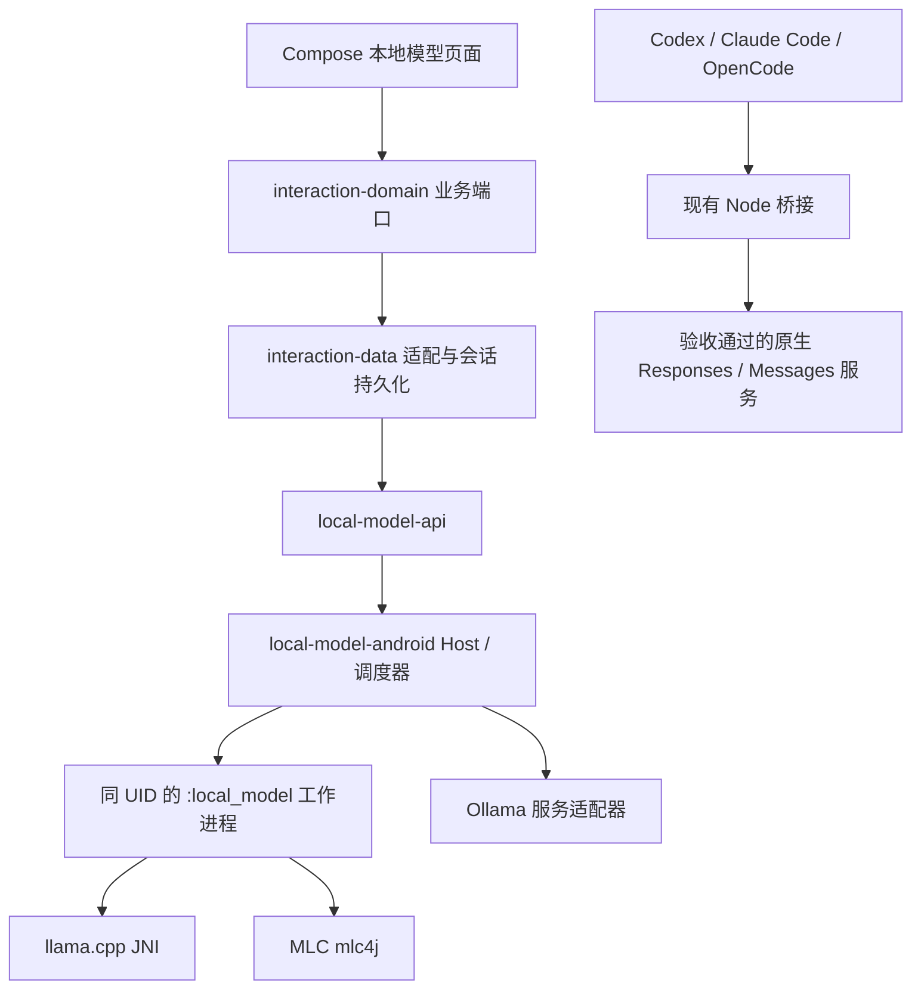

# 手机本地模型运行模块设计

状态：设计提案，尚未实现。核对日期：2026-09-24。

本文定义 mobby 的端侧大语言模型运行能力、模块边界、API、资源管理与验收门槛。这里的 Ollama、MLC LLM、llama.cpp 是推理运行时或服务框架；模型权重、量化格式、许可证和运行时是分别管理的对象。“手机本地”指推理发生在当前 Android 设备，不包括访问局域网电脑。

## 1. 设计结论与范围

建立独立的 `local-model` 子系统，对应用提供模型安装、兼容性检查、加载、流式生成、取消、卸载和诊断能力。采用可替换 Backend，不让 Compose、对话业务或 Agent 控制器直接依赖 JNI、MLC 或 Ollama。

推荐先用 **llama.cpp + GGUF + CPU** 打通端侧文本闭环，再加入 **MLC Android SDK** 验证 GPU 路径；**Ollama** 作为可选服务适配器，手机上的托管版本须先完成 Android 移植验证，不作为首版可用性的前提。这是按本项目集成成本作出的方案选择，不代表已测得性能排名。

首版支持用户主动下载或导入受支持的文本模型、离线多轮对话、逐段输出和停止。预留图片、工具调用及结构化输出能力，但只有具体模型与后端组合通过验收后才启用。首版不实现模型训练、任意 Python 模型执行、下载后运行原生代码、协议转换或自动云端回退。

两类入口分开：

- **应用本地推理**：使用本文 Kotlin API，适用于独立本地聊天、摘要等功能，不冒充 Codex/Claude/OpenCode Agent。
- **现有 CLI Agent**：保留本地 Node 桥接及原生协议约束。只有后端自身提供并通过验收的 Responses/Messages 路由才允许接入；不能将本地 Chat API 包装成这两种协议。

因此，“模型能生成文字”“支持某种 HTTP 协议”“能完成真实 Agent 工具循环”是三个独立的验收结果。

## 2. 现状与外部依据

### 2.1 已核对的项目边界

| 现有代码 | 已验证事实及对设计的影响 |
| --- | --- |
| [settings.gradle.kts](../../settings.gradle.kts) | 目前没有本地 LLM 模块；下文新增模块均为拟议 |
| [app/build.gradle.kts](../../app/build.gradle.kts) | minSdk 26、targetSdk 35、arm64-v8a、NDK 27.2.12479018；后端可能要求更高设备能力，须单独拒绝不兼容设备 |
| [GatewayContracts.kt](../../runtime-api/src/main/kotlin/com/github/ytlog/mobby/android/runtime/api/gateway/GatewayContracts.kt) | 网关协议只有 Responses、Messages；不得为了本地聊天新增伪兼容协议 |
| [AndroidRuntimePorts.kt](../../runtime-android/src/main/kotlin/com/github/ytlog/mobby/android/runtime/android/AndroidRuntimePorts.kt) | Agent 通过 Node 启动脚本运行，持有真实进程与会话状态 |
| [bridge.cjs](../../runtime-android/src/main/assets/gateway/bridge.cjs) | Node 本地 HTTP 桥接承担请求转发；此设计不声称现有 Agent 转发已由 Kotlin HTTP 客户端完成 |
| [RuntimeService.kt](../../runtime-android/src/main/kotlin/com/github/ytlog/mobby/android/runtime/android/RuntimeService.kt) | 现有服务管理 CLI 生命周期；不能把 JNI 加载进 UI 进程并假设协程取消等于 native 推理已停止 |
| [项目约定](../../AGENTS.md) | UID/SELinux 边界、不提权、不转换协议、真实错误与取消、配置加密、保持 applicationId 和 Keystore 别名 |

只复用仍适用的职责和模式，不把本地模型状态塞入 CLI 进程注册表，不让模型文件成为普通对话附件。

### 2.2 引擎比较

| 后端 | 官方依据 | 本项目定位 | 限制与接入门槛 |
| --- | --- | --- | --- |
| llama.cpp | 官方 [Android 文档](https://github.com/ggml-org/llama.cpp/blob/master/docs/android.md) 描述 Android 构建和集成 | 首个嵌入式后端；NDK/JNI，先 CPU，GPU 后续按机型测试 | GGUF 不等于支持全部模型架构；模板、tokenizer、量化类型和 native 版本必须匹配 |
| MLC LLM | 官方 [Android SDK](https://llm.mlc.ai/docs/deploy/android.html) 提供 mlc4j、TVM runtime 和模型库打包路径 | 第二个嵌入式后端，重点评估移动 GPU | 权重须匹配编译模型库和运行时；不能把任意 GGUF 直接交给 MLC；真机验证 GPU |
| Ollama | 官方[下载入口](https://ollama.com/download)列出 macOS/Linux/Windows；未据此确认官方 Android SDK | 可选 HTTP 服务后端；手机托管为实验项，外部设备作为网络模型单列 | Linux ARM64 二进制不能直接视作 Android 可用；需确认 Bionic、进程启动、驱动与资源控制 |

Ollama 当前官方文档包含 [Responses 兼容接口](https://docs.ollama.com/api/openai-compatibility)，并注明不支持有状态的 `previous_response_id`/`conversation`；还提供 [Messages 兼容说明](https://github.com/ollama/ollama/blob/main/docs/api/anthropic-compatibility.mdx)。不能再用“Ollama 只有 Chat Completions”作为设计前提，也不能由这些说明推导出固定 CLI 的全部行为均已兼容。

MLC 的 Android 集成使用构建期打包的运行时与模型库，权重可独立交付；本项目选择仅支持已随应用构建并验证的模型库组合。上游资料说明可行路径，本文没有进行编译、模型下载或手机性能测试。

## 3. 模块与依赖

对外称为一个“本地模型模块”，内部按稳定契约、调度和 Android 实现拆分。避免创建一个同时包含 Compose、下载、推理与业务数据库的巨型模块。

| 拟议 Gradle 模块 | 职责 | 允许依赖 |
| --- | --- | --- |
| `:local-model-api` | 公共 DTO、客户端、事件、错误、能力与版本契约；纯 Kotlin/JVM | coroutines、serialization |
| `:local-model-engine` | 准入、任务状态机、内存租约、排队、Backend SPI；纯 Kotlin/JVM | api |
| `:local-model-android` | Binder host/worker、模型存储、下载、硬件探测、Android 生命周期 | api、engine；后端通过组合根注入 |
| `:local-model-backend-llama` | JNI 封装、GGUF 检查、模板/tokenizer、native 中断 | api、engine、NDK 构建产物 |
| `:local-model-backend-mlc` | mlc4j、编译模型库映射、MLC 事件适配 | api、engine、固定版本 mlc4j |
| `:local-model-backend-ollama` | 服务身份、原生 API、NDJSON 流、HTTP 取消 | api、engine、Android 网络客户端 |

`app` 是组合根，决定打包哪些后端；首版只打包 llama。后端实现不反向依赖 app、interaction 或 runtime 模块。UI 放在现有 `interaction-ui` 的 `localmodel` 包；业务通过 `interaction-domain` 的端口访问，由 `interaction-data` 适配 API。包名前缀统一为 `com.github.ytlog.mobby.android.localmodel`。



这是运行调用关系；上表定义编译期依赖。CLI 到原生服务的路径不经过应用聊天 DTO。MLC/llama 嵌入式后端首版没有这条 CLI 服务路径。

## 4. 进程、所有权与生命周期

### 4.1 Host / Worker

- Host 位于应用侧，拥有唯一调度器、模型目录、任务日志和 Binder 客户端；只处理元数据，不加载 native 推理库。
- `LocalInferenceService` 声明 `android:process=":local_model"`、`exported=false`，默认仍为应用 UID；不设置 `isolatedProcess=true`。进程隔离用于限制 native 崩溃影响，不声称是新的安全沙箱。
- Worker 加载 JNI/mlc4j，持有模型句柄和 KV cache。预留后端注册表，首版同一时刻只启用一个后端、一个驻留模型、一个生成任务。
- Binder 传递有大小限制的命令和合并后的事件批次；模型文件和大输入使用只读 `ParcelFileDescriptor`/受控流。禁止跨 Binder 传完整权重、Base64 大图片或无界会话 JSON。建议每批事件不超过 32 KiB，总请求上限由能力返回。
- `MobbyApplication` 的 Worker 初始化分支不得重复初始化 Compose、CLI runtime 或启动另一个 Host。Host 与 Worker 断开时分别清理；Host 死亡后 Worker 停止生成并释放资源。
- Worker 死亡：未终结任务记为 `FAILED/ENGINE_DIED`；不自动重放生成、不显示成功。重启只恢复目录和历史状态，不恢复 native 指针或宣称 KV cache 仍有效。

### 4.2 前后台与资源

首版只承诺应用前台交互式推理；退到后台时给出短暂清理窗口，取消生成并卸载空闲模型。若后续实现后台持续生成，必须另行落实适用的前台服务类型、用户可见通知、停止入口及 Android 限制，再启用对应能力。现有 RuntimeService 的 `specialUse` 声明不能直接当成本地推理后台资格。

不长期持有 WakeLock。Worker 完成卸载并确认资源释放后才允许下一任务进入加载。相机、语音和 CLI 也会占用内存；准入使用当前系统余量与保守预算，不能只按设备标称 RAM 分档。

### 4.3 数据所有权

| 数据 | 所有者与存储 |
| --- | --- |
| 模型权重、分片、tokenizer、模板 | local-model 私有文件目录，排除自动备份；不进入 HOME/工作区或 Git |
| 下载与安装状态、文件哈希、性能基线 | 独立模型元数据存储；开发期结构变化只重建该数据库，不影响其他数据 |
| 用户选择、网络服务地址、下载访问凭据 | 设备加密配置；凭据使用现有受保护存储模式，不进入 DTO 的 `toString` 或日志 |
| 对话历史、用户输入、模型输出 | interaction-data；Worker 不额外建立一套历史库 |
| KV cache、native 句柄、会话 token | 仅 Worker 内存；默认不持久化 |
| 请求状态与完成摘要 | Host 的有界运行日志；文本由业务按事件序号保存，日志不复制 prompt |

## 5. 模型包与安装 API

### 5.1 不可变模型身份

用 `ModelRef(id, revision)` 引用安装版本，revision 是完整规范化 manifest 的 SHA-256。下载后重新计算所有文件哈希，不能仅相信文件名或远端 ETag。一个模型的 GGUF 和 MLC 包是两个 artifact，可共用展示名称，但不是可互换的安装版本。

Manifest v1 必须包含：

| 字段 | 约束 |
| --- | --- |
| `schemaVersion`、`id`、`displayName` | 拒绝未知主版本；id 不得用作未校验的文件路径 |
| `engine`、`format`、`architecture`、`quantization` | 例如 llama/GGUF 与 MLC 专属格式；未知架构不可直接加载 |
| `files[]` | 相对路径、长度、SHA-256、文件角色；拒绝 `..`、绝对路径、链接逃逸和解压炸弹 |
| `tokenizer`、`chatTemplate` | 文件引用或 GGUF 内嵌来源，并记录哈希；不猜模板、不拼通用角色标签 |
| `runtimeCompatibility` | 后端构建 ID、ABI、最低 API、GPU 要求；MLC 另含已打包 `modelLibId` 与编译参数 |
| `contextLimit`、`capabilityClaims` | 模型声明上限及能力，只是候选，不代替设备验证 |
| `license`、`sourceRevision` | 权重来源、许可文本/链接、再分发约束；框架开源不代表权重可任意再分发 |
| `resourceProfile` | 权重大小、测试上下文下的峰值内存与测试设备；未知值用 null，不填猜测数据 |

推荐目录：`files/local-models/blobs/<sha256>`、`staging/<installId>`、`manifests/<revision>.json`。MLC 原生代码来自 APK 构建，不从模型 URL 下载 `.so` 后执行。受支持的用户 GGUF 导入自动形成 manifest；非已知组合标为未验证，不显示已支持 Agent。

### 5.2 管理接口

以下为拟议公共契约，尚非现有可调用 SDK。Kotlin 中统一用密封 `LmResult<T>` 表示 `Ok(value)` / `Err(LocalModelError)`；`CancellationException` 继续传播。

```kotlin
interface LocalModelManager {
    fun observeModels(): StateFlow<List<ModelSnapshot>>
    suspend fun inspect(source: ModelSource): LmResult<InstallPlan>
    suspend fun install(planId: String): LmResult<InstallId>
    fun observeInstall(id: InstallId): Flow<InstallSnapshot>
    suspend fun cancelInstall(id: InstallId): LmResult<Unit>
    suspend fun evaluate(model: ModelRef, options: LoadOptions): LmResult<LoadPlan>
    suspend fun load(planId: String): LmResult<LoadId>
    fun observeLoad(id: LoadId): Flow<LoadSnapshot>
    suspend fun cancelLoad(id: LoadId): LmResult<Unit>
    suspend fun unload(model: ModelRef): LmResult<Unit>
    suspend fun remove(model: ModelRef): LmResult<Unit>
}
```

`ModelSource` 为目录条目或 Android 导入句柄对应的受控引用；不向纯 Kotlin API 暴露 `Context`。`InstallPlan` 固定 manifest、来源、字节数、磁盘需求和过期时间。`LoadPlan` 固定模型 revision、实际后端/设备、上下文及内存预算。执行时重新校验当前资源；计划不等于预留成功。

安装状态：`QUEUED → DOWNLOADING/IMPORTING → VERIFYING → INSTALLED`，可结束为 `CANCELLED` 或 `FAILED`。缺少任何文件都不可发布为 INSTALLED。先 staging，全部验证后原子发布；崩溃恢复清扫 staging，保留已安装版本。Range 续传须核对对象标识和偏移，不支持则重新下载；取消保留的分片进入有界缓存并可清理。

`remove` 在模型存在活动租约、加载或生成时返回 `MODEL_IN_USE`，用户须先停止并卸载；按 blob 引用计数回收文件。磁盘预算包含分片、临时文件、旧版本和余量。升级不替换正在运行的 revision。

## 6. 推理 API 与契约

### 6.1 公共数据模型

```kotlin
data class GenerateRequest(
    val requestId: String,
    val model: ModelRef,
    val messages: List<LocalMessage>,
    val generation: GenerationOptions,
    val requiredCapabilities: Set<Capability>,
    val queueTimeoutMs: Long,
    val executionTimeoutMs: Long,
)

data class LocalMessage(val role: Role, val parts: List<ContentPart>)
enum class Role { SYSTEM, USER, ASSISTANT, TOOL }

sealed interface ContentPart {
    data class Text(val text: String) : ContentPart
    data class Image(val resource: LocalResourceRef) : ContentPart
    data class ToolCall(val id: String, val name: String, val arguments: JsonObject) : ContentPart
    data class ToolResult(val callId: String, val value: JsonElement) : ContentPart
}

data class GenerationOptions(
    val maxOutputTokens: Int,
    val temperature: Double?,
    val topP: Double?,
    val seed: Long?,
    val stop: List<String>,
)

interface LocalModelClient {
    suspend fun capabilities(model: ModelRef): LmResult<EffectiveCapabilities>
    suspend fun submit(request: GenerateRequest): LmResult<RunId>
    fun observe(runId: RunId, afterSequence: Long = 0): Flow<InferenceEvent>
    suspend fun snapshot(runId: RunId): LmResult<RunSnapshot>
    suspend fun cancel(runId: RunId): LmResult<CancelReceipt>
}
```

`ModelRef` 是 `(id, revision)`；`InstallId/LoadId/RunId` 是不可复用的 opaque ID。`LocalResourceRef` 是由 Host 导入后分配的资源句柄，不能传任意绝对路径或 URL。`LoadOptions` 包含上下文 token 上限、指定或允许的 CPU/GPU 设备及内存上限；`EffectiveCapabilities` 返回实际输入类型、采样参数、上下文/输出上限、请求字节数上限和证据 ID。

`GenerationOptions` 不采用无约束的参数 Map；null 表示使用有版本记录的后端默认值，实际值进入运行快照。不支持显式指定的 seed、采样参数或内容类型时返回错误，不能静默忽略。首版只接受文本 `ContentPart`，其余类型在 API 中保留，但能力关闭。后续工具调用只输出结构化提议，由既有工具执行层处理；推理模块不获得设备操作权限。

`submit` 先校验模型、输入类型、模板/tokenizer、token 预算和资源，再接受。请求必须引用 READY 模型；调用方先观察 `load` 成功，再提交。排队接受时持有轻量模型租约，避免中途删除。首版同模型队列上限建议为 2，满时返回 `BUSY`；切换模型必须等活动任务释放，禁止并发 load 穿透调度器。

多轮请求发送完整、明确选择的历史，业务层持久化内容。首版不暴露有状态 conversation ID；优化 KV cache 时仅按模型 revision、模板、token 序列前缀和加载参数复用，不依赖会话名称。超限返回 `CONTEXT_LIMIT`；不自动截断历史、不悄悄缩短输出、不自动总结。

### 6.2 事件与终态

所有事件均带 `runId`、递增 `sequence`、单调时间和负载；单任务严格有序。以追加增量定义 `TextDelta`，禁止发送累计全文冒充增量。

| 事件 | 语义 |
| --- | --- |
| `Accepted`、`Queued` | 已接受或等待；不是开始推理或成功 |
| `Started` | 返回实际后端、模型 revision、设备及生效参数 |
| `PrefillProgress` | 可选；后端无准确进度则省略 |
| `TextDelta` | 追加文本；保留 UTF-8 边界，不暴露半个字符 |
| `Usage` | 可选 token/耗时统计；无法取得用 null，不以字符数伪装 token 数 |
| `Completed` | 唯一成功终态；finishReason 为 STOP 或 LENGTH，LENGTH 在 UI 表示达到上限 |
| `Cancelled` | 后端已确认停止或 Worker 已确认退出；不是取消请求已发出 |
| `Failed` | 错误终态，可能已有部分文本；保留部分输出并标注中断 |

状态机：`ACCEPTED → QUEUED → RUNNING → COMPLETED`；非终态可进入 `CANCELLING → CANCELLED` 或 `FAILED`。自然完成与取消竞态由 Host 串行裁决，先提交的终态生效，后续回调按 runId 和 worker generation 丢弃；恰好一个终态。

`cancel` 幂等返回 `REQUESTED`、`ALREADY_TERMINAL` 或错误；REQUESTED 不表示资源已释放。协程收集器停止只取消观察，不取消生成，界面离开需要按产品生命周期显式 cancel。加载取消走同一 native 停止机制，不把不响应的加载线程留给下一次 load。

Host 为业务订阅者提供有界、可确认序号的事件缓冲，默认上限建议 1 MiB/任务；必须在编码前限制超大 delta。消费慢时背压，无法暂停的后端且缓冲耗尽则停止任务并报 `CONSUMER_TOO_SLOW`，不丢文本。`afterSequence` 在当前缓存保留范围内重放；超出返回 `EVENT_HISTORY_EXPIRED`，调用方读取快照和业务已保存文本，不自动重跑。订阅须先挂接实时队列再读取缓存，防止重放与实时之间漏事件。终态摘要独立保留；持久化失败不能报告已可靠保存。

`requestId` 在有界保留期内作为幂等键：同 ID 同请求摘要返回原 RunId，不再生成；同 ID 不同内容返回 `REQUEST_CONFLICT`。快照返回保留截止时间；requestId 使用包含生成时间的 UUIDv7，并校验允许的时钟偏差；超过保留窗口的 ID 返回 `REQUEST_EXPIRED`，不能将旧请求默默当作新任务。保留窗口内不得提前删除幂等记录；容量不足时拒绝新准入。

### 6.3 错误

统一 `LocalModelError(code, retryable, stage, diagnosticId, safeDetails)`，不包含 prompt、凭据、原始服务响应或私有绝对路径。

| 分类 | 主要错误码 | 行为 |
| --- | --- | --- |
| 能力/输入 | `UNSUPPORTED_BACKEND`、`UNSUPPORTED_MODEL`、`UNSUPPORTED_CAPABILITY`、`INVALID_ARGUMENT`、`CONTEXT_LIMIT` | 加载或生成前拒绝，并给出可理解原因 |
| 安装 | `STORAGE_FULL`、`DOWNLOAD_FAILED`、`CHECKSUM_MISMATCH`、`LICENSE_REQUIRED` | 保留旧版本，清理或保留可续传分片 |
| 资源 | `MODEL_NOT_READY`、`MODEL_IN_USE`、`BUSY`、`INSUFFICIENT_MEMORY`、`THERMAL_LIMIT` | 不自动换模型/换设备/联网 |
| 运行 | `QUEUE_TIMEOUT`、`EXECUTION_TIMEOUT`、`ENGINE_DIED`、`ENGINE_ERROR`、`STOP_UNCONFIRMED` | 保留部分结果，不自动重放 |
| 流/服务 | `CONSUMER_TOO_SLOW`、`EVENT_HISTORY_EXPIRED`、`SERVICE_UNAVAILABLE`、`PROTOCOL_MISMATCH` | 明确恢复方式，不能补造成功终态 |

超时以单调时钟计算；排队时间和执行时间分开，执行截止包含预填充与解码。用户取消与执行超时保留不同原因。

## 7. Backend SPI 与资源调度

Backend 不拥有下载、UI、历史或网关选择，只负责一套固定版本 runtime 的运行行为。

```kotlin
interface LocalModelBackend {
    val descriptor: BackendDescriptor
    suspend fun probe(artifact: VerifiedArtifact, device: DeviceProfile): SupportReport
    suspend fun estimate(artifact: VerifiedArtifact, options: LoadOptions): MemoryEstimate
    suspend fun load(artifact: VerifiedArtifact, options: LoadOptions): BackendHandle
    fun generate(handle: BackendHandle, input: PreparedInput): Flow<BackendEvent>
    suspend fun abort(handle: BackendHandle, operationId: String): StopResult
    suspend fun unload(handle: BackendHandle): ReleaseResult
}
```

SPI 失败用类型化异常交给 Host 映射；上层不能依赖 vendor 异常字符串。`VerifiedArtifact` 只由安装器签发，含已校验文件句柄和 immutable manifest；`PreparedInput` 包含校验后的内容及同版本 tokenizer/template 信息。Backend 必须保证准入计数与实际推理使用同一模板/tokenizer，不再套第二层模板。`BackendHandle` 绑定 worker generation，跨进程重启必失效。

初始策略：一个驻留模型、一个生成槽位，空闲 60 秒卸载；这些是可调默认值，后续依据实测修改。内存估算包含：

`权重驻留 + KV cache(上下文、并发) + prefill/计算缓冲 + GPU/驱动分配 + runtime 固定开销 + 安全余量`

模型文件大小不是峰值内存。Android 共享内存环境下不能把 CPU RAM 与 GPU 显存预算相加为两份可用容量。mmap 也不等于没有 RSS 成本。无法获得可靠估计的组合先标记未验证，仅在专门验证流程中运行，不向普通用户承诺可用。

能力取交集：`后端已实现 ∩ 模型声明 ∩ 当前硬件支持 ∩ 产品策略 ∩ 验证证据`。设备探测结果只有候选资格；GPU 在指定机型/驱动上通过实际加载与生成才进入可用列表。GPU 失败不静默切 CPU；可以返回重新以 CPU 加载的建议，当前请求失败后由调用方明确重试。

native 解码须接入引擎停止机制，单纯取消 Kotlin Job 不够。建议停止确认期限为 3 秒；若线程失去响应，由 Host 请求受控终止专用 Worker 并等待 Binder death。确认死亡后才能释放调度租约；无法确认则 `STOP_UNCONFIRMED` 并阻止新任务。只处理本模块拥有的进程，禁止按名称杀死外部服务。

热状态严重或系统低内存时停止新准入；必要时停止当前任务，待确认结束再卸载。允许降低线程数等已声明且不改变请求内容的调度参数，并记录变化；不能运行中悄悄降低上下文。长时间压力测试应覆盖降频、锁屏、后台、低内存和重复装卸。

## 8. Ollama 适配与现有 Agent 接入

### 8.1 三种部署身份

| 身份 | 是否可标“本机离线” | 管理权限 |
| --- | --- | --- |
| `EMBEDDED`：应用 Worker 内 llama/MLC | 已安装模型且断网验证通过后可标记 | 应用控制生命周期 |
| `MANAGED_LOCAL_SERVICE`：未来应用托管 Ollama | 仅在 Android 构建、归属、禁止云推理和断网验证均通过后 | 应用只管理自己启动的服务与私有模型目录 |
| `EXTERNAL_SERVICE`：用户填写 Ollama 地址 | 一律标“外部服务”；loopback 也不能单凭地址证明离线 | 应用只能连接，不杀进程、不替其删除模型 |

Ollama 的 [FAQ](https://docs.ollama.com/faq) 提供禁用云能力的配置方式。本项目托管模式应设置 `OLLAMA_NO_CLOUD=1`、限制模型来源并通过断网测试；这是接入要求，不是已完成的离线保证。外部服务可能转发云模型，不能仅凭 `/api/tags` 或 `127.0.0.1` 宣称数据不会离开手机。

原生 Ollama 聊天适配器通过 Android 网络客户端使用 `/api/chat`、读取 NDJSON，并按明确的 done/error 状态映射本地事件。连接中断无 done 为失败；未识别的语义字段不得静默丢弃并继续声称兼容。此处是应用 Local Chat API 的适配，不接收现有 CLI 的 Responses/Messages 请求。只有真正可映射的工具/图片等能力才开放，不能把结构化工具调用塞进普通文本。

嵌入式路径默认不开 HTTP 端口。未来托管 Ollama 只绑定 loopback，使用受控启动配置。Ollama 本地服务不能被假设会校验任意 Bearer key；现有 Node 桥接的随机 token 保护桥接入口，不保护下游无鉴权端口。若下游不能限制其他应用连接，需要明确该边界；不得宣称 loopback 是应用私有网络。

### 8.2 CLI 路由规则

路径固定为 `CLI → 现有 Node 桥接 → 后端原生协议端点`，网络保持当前 Android 环境执行路径。`GatewayProtocol` 不新增 Chat Completions，也不经 `LocalMessage` 序列化。保留请求中工具、图片、推理和未知字段；不支持时拒绝，不删除字段求成功。

| Agent | 必须通过的协议与行为 |
| --- | --- |
| Codex | Responses；流式、函数/自定义工具实际使用路径、续接、推理字段、取消及实际调用的辅助接口 |
| OpenCode | Responses；固定 provider 的真实请求、工具循环、续接与停止 |
| Claude Code | Messages；工具输入/结果、stream、计数等实际辅助接口，保留现有 stdio 审批控制 |

增加独立 `AgentCompatibilityReport`：记录 engine build、model revision/digest、CLI 版本、请求特征集合、设备和验收证据。协议探测成功只生成候选路由，报告通过后才展示为对应 Agent 的可执行选项。未知字段在透传前后完整保留的测试，与后端对该字段是否真正支持的测试，必须分别执行。

Ollama 无状态 Responses 限制可能与 CLI 续接方式冲突，须用当前固定版本 CLI 验证；不在桥接里实现 previous_response_id 展开来掩盖不兼容。MLC/llama 没有已验收原生服务端点时只提供本地推理入口。后续若单独集成某引擎的官方 server，必须作为新的部署形态验收，不能由 JNI 文本生成能力推导支持。

本地 endpoint/端口是短期运行资源。持久配置存稳定的模型和部署引用，运行前解析实际端点并生成短期执行快照；不把随机端口永久写入旧网关记录。先为现有远端 endpoint 建立明确分支，再增本地路由；保留现有配置及密钥，不静默改写。

## 9. UI 与调用示例

设置增加“本地模型”入口，展示设备兼容性、安装大小、运行内存估计、许可证、下载进度和实际后端。模型卡区分“未安装 / 校验中 / 可加载 / 加载中 / 已就绪 / 运行中 / 不兼容 / 失败”，不把 INSTALLED 显示成正在占用 GPU。

本地会话入口与现有 Agent 入口分开。会话记录明确模型 revision 与实际 CPU/GPU；生成时支持停止，失败保留部分文本。下载前明确体积和网络条件；不自动下载大模型。删除展示实际可回收空间，运行中要求先停止。外部 Ollama 服务展示其网络身份，不混入离线列表。

调用顺序示意（省略业务错误分支，不是现有 SDK 示例）：

```text
manager.inspect(source) → InstallPlan
manager.install(plan.id) → InstallId
observeInstall → INSTALLED
manager.evaluate(modelRef, loadOptions) → LoadPlan
manager.load(plan.id) → LoadId
observeLoad → READY
client.capabilities(modelRef) → EffectiveCapabilities
client.submit(完整历史、采样设置、唯一 requestId) → RunId
client.observe(runId) → Started、TextDelta*、Completed/Cancelled/Failed
停止按钮 → client.cancel(runId) → REQUESTED → 等待真实终态
manager.unload(modelRef) → 已确认释放
```

业务收集器保存事件序号和文本；界面重建重新订阅，不重新 submit。非文本能力不可用时在发送前提示并拒绝该输入，不去掉图片后自动发送。

## 10. 分期交付与验收

| 阶段 | 交付 | 必须满足的退出条件 |
| --- | --- | --- |
| P0：契约与设备基线 | api/engine、fake backend、受控模型 manifest、独立 Worker 骨架 | 状态机、取消竞态、幂等、重放、背压和资源租约测试通过；确定首台真机与权重许可 |
| P1：端侧文本闭环 | llama CPU、导入/下载、校验、加载、离线本地对话 UI | 真机断网完成多轮中文生成、停止和卸载；native 崩溃不带倒 UI；无 Agent 兼容宣传 |
| P2：MLC 与 GPU | 固定编译模型库、GPU 探测和设备验证记录 | 同任务质量/耗时/能耗对比，记录不可用设备原因；按能力开放，不自动切换 |
| P3：可选 Ollama | 外部服务客户端；Android 托管作为独立实验交付 | 外部服务有明确网络身份；托管版另过原生构建、进程回收、离线与端口边界验收 |
| P4：Agent 集成 | 原生协议路由、AgentCompatibilityReport | 每个启用组合通过真 CLI + 真模型 + 真机工具循环；不通过则保持不可用 |

契约单测先覆盖：取消前/生成中/完成竞态、加载中取消、Worker death、队列超时、重复 requestId、不同模型争用、删除运行模型、损坏包、路径逃逸、上下文超限、缓冲耗尽及订阅缺口。发现可复现问题先添加失败回归测试，再修正实现。

Android 验证覆盖：Binder 死亡与大输入、主/子进程初始化、旋转与返回、后台/锁屏、下载中断/空间不足、热与内存压力、安装覆盖更新。native 库还需检查设备页大小兼容及依赖符号冲突；不为了验证自行下载新的系统镜像。

真机性能记录必须包含：设备/SoC/API/RAM、引擎 commit/build ID、模型哈希/量化、上下文、线程/GPU 设置、冷加载耗时、首 token 延迟（区分排队/加载/prefill）、生成 token/s、峰值进程内存、系统内存变化、热状态和连续运行耗电。按 1K/2K/4K 等设备可承受上下文测量；不预先承诺某参数规模一定流畅。

功能门槛：完全断网时已安装模型仍可生成；停止后不再产生文本且资源租约释放；损坏权重不会被加载；不支持的图片/工具/协议明确拒绝；进程死亡不显示成功；默认不存在云请求。真实 Agent 门槛另覆盖读工作区测试文件、提出工具调用、接收结果、继续回答与取消；模拟网关成功不能替代这些测试。

实现阶段执行新增模块相关单测与 Android 构建，并回归项目常用命令：

```sh
node --test runtime/gateway-tests/bridge.test.cjs
python3 -m unittest discover -s runtime -p 'test_*.py'
# 使用 JDK 17
./gradlew :app:assembleDebug :app:testDebugUnitTest :termux-core:testDebugUnitTest :app:lintDebug
```

本次仅交付设计文档与索引，不创建空实现模块、不修改现有网关配置、不下载模型。待实现时首先确定首个权重的不可变来源和许可、首台设备基线及固定 native 版本，再开展 P0/P1。
