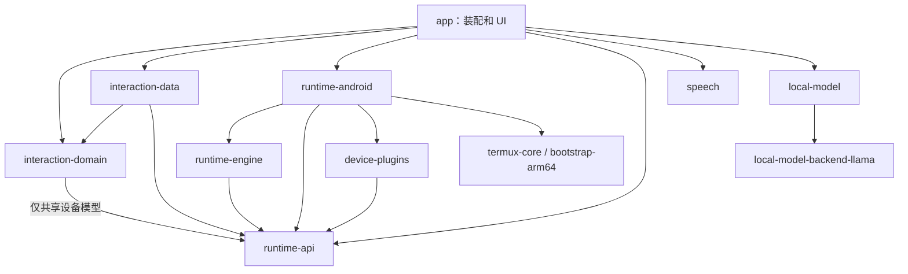

# Gradle 模块收敛评审

日期：2026-09-29。状态：设计提案，尚未执行模块合并。

本文只评审模块粒度、依赖与合并顺序；执行协议、恢复语义和存储契约沿用 [交互与 Runtime 设计](interaction-runtime-architecture.html)，以当前代码和 [开发约定](../../AGENTS.md) 为准。本文不表示旧设计中的所有目标均已实现。

## 结论

当前 17 个 Gradle 模块中，15 个是项目自有模块，2 个是内置 Termux 依赖。存在局部过度拆分，建议收敛到 **13 个模块：11 个自有模块 + 2 个第三方模块**。

合并四处：设备协议进入 runtime-api；设备卡片进入应用展示包；App Functions 进入 device-plugins 的独立子包；interaction-ui 进入 app。保留会话领域/数据、Runtime API/引擎/平台、语音、本地化、本地模型服务/原生后端的边界。

这是一种针对现有工程的取舍：把只有一个宿主的展示代码按包组织，同时保留已有价值的 JVM 测试、平台依赖和独立服务边界。模块减少不保证构建更快，须在实施前后测量增量构建。Android 官方也建议在细拆成本超过收益时合并模块，且同时提醒过度合并会失去封装和测试收益，见 [模块化指南](https://developer.android.com/topic/modularization)。

## 现有代码核查

规模统计只含各模块 src/main 下的 Kotlin、Java、C++ 与头文件，不含资源、资产、生成代码和第三方源码。测试数为 src/test 与 src/androidTest 的源码文件数，不等于测试用例数。runtime/ 是脚本与测试目录，不是额外 Gradle 模块。

| 当前模块 | 主源码文件 / 行数 | 测试文件 | 决策与依据 |
| --- | ---: | ---: | --- |
| app | 2 / 228 | 11 | 接纳应用 UI；现有宿主负责装配与生命周期 |
| interaction-ui | 33 / 6,770 | 42 | 合并到 app；现有唯一生产消费者是 app |
| interaction-domain | 7 / 645 | 5 | 保留纯 JVM 业务规则与端口；已有提交、草稿、会话和项目规则 |
| interaction-data | 16 / 1,625 | 4 | 保留 Room、事件投影、排队和 Runtime 适配 |
| runtime-api | 4 / 460 | 5 | 保留并接纳设备协议模型；跨子系统共享契约 |
| runtime-engine | 11 / 1,815 | 10 | 保留；四种 CLI 会话、协调器与平台端口可单独 JVM 测试 |
| runtime-android | 23 / 2,687 | 20 | 保留；Service、进程、环境、网关密钥和日志依赖 Android |
| device-interaction | 2 / 221 | 1 | 协议合并到 runtime-api；显示文案移出契约 |
| device-interaction-ui | 2 / 315 | 1 | 合并到应用 UI；只由 interaction-ui 消费 |
| device-plugins | 17 / 1,993 | 3 | 保留设备执行能力，接纳 App Functions |
| plugin:appfunction | 4 / 615 | 2 | 合并到 device-plugins；当前是静态打包适配器，未见独立动态加载路径 |
| speech | 4 / 441 | 1 | 保留；隔离 Sherpa/ONNX AAR 和模型下载依赖 |
| localization | 4 / 904 | 1 | 保留；多个 JVM/Android 子系统共享文案与提示词，避免反向依赖 app |
| local-model | 12 / 1,736 | 5 | 保留；独立 HTTP 服务、模型存储与管理入口 |
| local-model-backend-llama | 3 / 524 | 0 | 保留；JNI/CMake/NDK 构建边界，行数不含 llama.cpp 本体 |
| termux-core、bootstrap-arm64 | 第三方 | 未纳入上表统计 | 保留上游核心与环境打包边界 |

核查入口：settings.gradle.kts、各模块 build.gradle.kts、MobbyApplication、InteractionFactory、RuntimeAdapters、RuntimeClient、RuntimePorts、AndroidRuntimePorts，以及设备和本地模型 Manifest。

已确认的职责问题：

- device-interaction 同时放 DeviceOperation 协议和 DeviceLabels 显示文案，runtime-api 间接依赖 localization；协议边界因此带入语言状态。
- DirectPluginSelector 直接调用 DeviceStorage.persist，展示层知道设备存储实现。系统选择器应留在 UI，持久授权和存储操作应经端口执行。
- interaction-domain 已包含 AppStrings，且业务规则分布在 InteractionUseCases 和数据层的多个 Manager 中。当前分层并非完全纯净，模块合并不能替代逐项核对规则归属。
- runtime-android 同时接入 DeviceHost 和 AppFunctionHost，二者共用执行上下文、资源引用和设备响应通道；App Functions 可作为设备能力子包继续维护。
- LocalModelService Manifest 明确使用 :local_model 进程。MobbyApplication 会跳过该进程的 Agent 初始化，独立性应继续保留。

未测量构建耗时，未重新运行手机、真实 CLI 或网关；本文结论来自代码和构建配置的静态评审。

## 四项合并

### 1. device-interaction → runtime-api

将 DeviceOperation、DeviceRecord、响应、错误码及相关序列化模型放到 runtime-api 内的 device 契约包。它们是运行事件的一部分，也是 CLI 设备能力和卡片之间的共享结构，保留独立 Gradle 工程的收益有限。

先将 DeviceLabels 的显示逻辑移到 app 展示包；通用文案键可以进入 localization，但 localization 不反向依赖设备模型。DeviceCapture 当前只调用 DeviceLabels.text 来显示“试听录音”，应改用 localization 文案。协议模型不依赖语言、Compose、Android 或设备实现。

代价要明确：interaction-domain 当前依赖独立的 device-interaction，合并后改为依赖 runtime-api 的设备契约包。它不再是完全不接触 Runtime 契约的领域模块。允许共享不可变设备模型，避免为同一个记录新增全量复制和映射；禁止领域代码使用 RuntimeClient、RuntimeAdminClient、RunRequest 或运行实现。通过 import 检查维持该约束，Gradle 单独无法限制到包。

既有 ConversationId、草稿和会话配置仍归领域；运行提交、查询和事件转换仍归数据适配层。不能借合并取消这条边界。

若以后必须要求领域与所有 Runtime 契约完全隔离，则保留 device-interaction 更合适，总数为 14；不要一边要求严格零依赖，一边宣称合并没有代价。

### 2. device-interaction-ui → 应用展示包

DeviceTaskCard 和 DeviceResourceDialog 与现有 ConversationDeviceCard 合在一个展示目录。各类设备动作仍使用结构化协议，卡片仍只接受状态和回调；取消、资源预览、用户响应经用例执行。

卡片是可复用 Compose 函数即可，当前不需要为两份组件维护独立 Android Library、Compose 配置和测试宿主。迁移时保留原测试及其行为断言。

### 3. plugin:appfunction → device-plugins

AppFunctionCatalog、Host、Skills 与 JSON 编解码放在 device-plugins 的 appfunctions 子包，平台版本判断和权限检查留在该适配器。与屏幕、文件、短信能力共享模块，但不强行改成同一套操作实现。

保留 EXECUTE_APP_FUNCTIONS 权限、包查询声明、可用性状态、发现/调用行为和现有明确确认语义。设备不支持或系统拒绝时继续如实返回结果。模块合并不改变 Agent 工具授权规则。

合并时 device-plugins compileSdk 对齐到现有 App Functions 所用的 36，不同时升级 alpha08 依赖。宿主最终合并 Manifest 保留同样声明；相关仪器测试同步迁移。未来如果需要独立发布、按构建变体排除该依赖或插件动态加载，再考虑拆回独立适配模块。

### 4. interaction-ui → app

目前只有一个 Android 宿主，主页面和悬浮会话共享应用生命周期。保留 UI 模块主要提供编译可见性约束，尚未看到第二个宿主或独立交付需求；可以把页面、ViewModel、主题和桌面宠物迁入 app 内的 ui 包。

app 仍通过独立 AppGraph 装配 RuntimeHost、InteractionFactory 和界面；页面不自行构造 Room、RuntimeHost 或设备 Host。既有 MainActivity 和 MobbyApplication 不变成业务中心。迁移初期保留源码包名，减少 import、Manifest、资源和测试的同时变更。

合并后 app 因装配而依赖 interaction-data/runtime-android，UI 代码也能在编译层访问它们；因此必须增加 ui 包 import 规则，禁止展示代码绕过用例访问存储和 Runtime 实现。构造函数注入与替换假端口的测试继续保留，不为这次收敛引入 DI 框架。

代价：约 7,000 行展示代码进入 app，原 UI Library 的编译与测试缓存边界消失。若实测 UI 频繁变更导致构建明显退化，或出现第二个宿主，可以只实施前三项合并，维持 14 个模块。

## 目标职责与依赖

保留原模块名，暂不同时做全项目命名重构。

```text
app
  graph/                       对象装配、导航目标、平台生命周期
  ui/conversation/             对话、输入、时间线、设备卡片
  ui/projects/                 项目与目录界面
  ui/settings/                 网关、技能、插件、存储设置
  ui/floating/                 悬浮窗口与桌面宠物
  ui/common/                   主题、Markdown、共享组件

interaction-domain [JVM]       会话业务规则、模型与执行/管理端口
interaction-data [Android]     Room、数据管理、事件投影、Runtime 适配

runtime-api [JVM]              执行/管理 API、事件、设备契约
runtime-engine [JVM]           RunCoordinator、CLI 会话与协议、平台端口
runtime-android [Android]      Service、Termux 适配、Node 桥接、网关、资源与日志

device-plugins [Android]       Android 设备能力与 App Functions 适配
speech [Android]               语音采集/识别与模型管理
localization [JVM]             文案与 Agent 提示词，不充当通用工具杂物箱

local-model [Android]          专用进程内的模型 HTTP 服务与管理入口
local-model-backend-llama      JNI、llama.cpp 与 CMake 配置

termux-core、bootstrap-arm64   原有第三方边界
```

下图中的箭头为编译依赖，不代表业务调用绕过端口：



多个模块依赖 localization，图中省略这些箭头。app 对 local-model 的编译依赖用于随宿主打包和启动入口；业务通信仍通过鉴权 HTTP API。Intent 只启动组件，不通过 Binder/AIDL、共享 Kotlin 对象或直接调用服务实现通信。

不要合并 interaction-domain 与 interaction-data：前者已有真实规则与 JVM 单测，后者绑定 Room/Context/资源导入。合并会让业务测试与 Android 存储共用工程，而当前减少一个模块的收益尚不足以抵消这一损失。

不要合并 runtime-engine 与 runtime-android：前者已有四种 CLI 原生协议会话与平台端口，纯 JVM 测试是当前重要验证路径。也不要为每种 Agent 再拆一套 api/impl 工程，在引擎内按协议子包组织即可。

speech 虽小，但它隔离了独立原生 AAR 和下载逻辑；local-model-backend-llama 虽然胶水代码不多，却隔离了整套 CMake/NDK 后端。这两处价值高于设备卡片的独立工程。

## 运行与数据所有权

| 事实或资源 | 单一所有者 | 其他层的访问方式 |
| --- | --- | --- |
| 会话、项目关联、草稿、排队、阅读状态 | interaction-data / Room | 用例与 Repository；UI 订阅投影 |
| run 真相、接纳幂等、取消、CLI 会话、事件与输出 | Runtime | RuntimeClient 与重放事件；会话数据只做投影 |
| 网关密钥、冻结配置引用、HOME 与执行目录资源 | runtime-android | 不透明引用、脱敏摘要与管理 API |
| 设备操作状态、系统权限检查、实际副作用 | device-plugins 的对应执行器 | 结构化设备记录与响应；不根据卡片显示猜成功 |
| 界面展开、焦点、系统选择器、悬浮窗口 | app UI | UI 状态与平台交互；页面销毁不停止运行 |
| 本地模型、下载、推理调度和服务状态 | local-model 专用进程 | 鉴权 HTTP API；不读取宿主 Room 或执行状态 |

现有运行路径继续为 CLI → 本地 Node 桥接 → Android 网络栈 → 原协议网关；Pi/Codex/OpenCode 使用 Responses，Claude Code 使用 Messages。模块整理不得顺带改协议、逐次授权策略或已有执行能力。

业务规则归属应逐条核对：项目/草稿/会话规则在领域，Room 事务、事件序号去重、游标更新、数据查询在数据层。运行事件中的终态由 Runtime 决定，不能在 UI 或 Room 中用字符串或 occupied 标志重新推断。

## 实施顺序与验证

1. 记录现有依赖图和构建基线，运行现有相关测试；对本轮另行确认的可复现缺陷先添加失败回归测试。建立领域和展示包 import 检查，显式列出装配代码例外。
2. 将 DeviceLabels 移出协议，再将 device-interaction 的模型与序列化测试移入 runtime-api。检查序列化名称/字段与旧测试结果一致，并运行领域、引擎、设备、数据和卡片的相关测试。
3. 将 device-interaction-ui 合入 interaction-ui，迁移资源、单测、Compose 测试与测试依赖，删除旧工程；此时仍保留独立 UI 模块。
4. 将 App Functions 合入 device-plugins，迁移 Manifest 和仪器测试，更新 runtime-android 与宿主测试依赖，移除旧工程。核对最终 Manifest 权限和查询声明、发现与调用确认行为。
5. 最后评估并将 interaction-ui 合入 app；先核对测试 Manifest、R 引用、namespace、资源、internal 可见性和测试 runner。迁移所有测试，检查主页面/悬浮会话共用同一用例与状态源，并复测增量构建。

每一步只保留一套生产实现，移除旧 settings include、build.gradle 依赖和空目录，不留下长期转发模块。失败可通过普通 revert 回退，不改写提交历史。不同时修改 applicationId、Keystore 别名、数据库结构、HOME 或用户配置。

最终验证除现有 Node/Python 测试外，使用 JDK 17 运行：

```sh
node --test runtime/gateway-tests/bridge.test.cjs
python3 -m unittest discover -s runtime -p 'test_*.py'
./gradlew :runtime-api:test :runtime-engine:test :interaction-domain:test
./gradlew :interaction-data:testDebugUnitTest :runtime-android:testDebugUnitTest :device-plugins:testDebugUnitTest :speech:testDebugUnitTest :localization:test :local-model:testDebugUnitTest
./gradlew :app:assembleDebug :app:testDebugUnitTest :termux-core:testDebugUnitTest :app:lintDebug
```

Compose 与 App Functions 仪器测试使用已连接手机和已有环境。另验证 Shell、四种 Agent、取消和错误传递、附件授权、设备操作、应用重启/前后台切换以及本地模型 HTTP 通信。真实 CLI 的模拟网关联调用隔离 HOME 和虚假密钥；模拟成功不能替代手机与真实网关验收。

新增 Gradle 模块应有明确证据：独立平台/原生依赖、独立发布或进程、多个实际消费者的稳定契约、独立测试需求，或测得的构建收益。新页面、新卡片、新 CLI 适配优先添加包与类。
